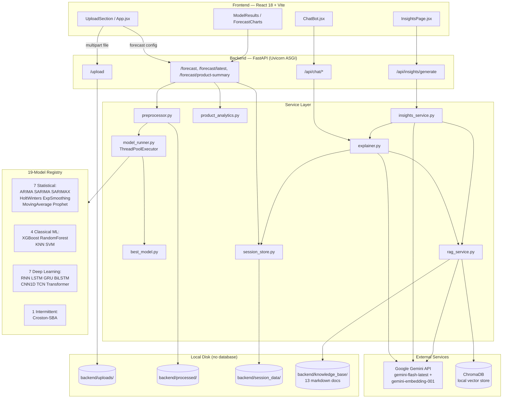
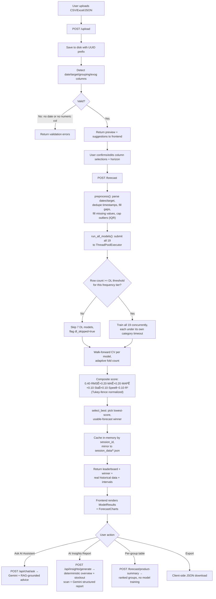

# 📊 DemandSense AI — Retail Demand Forecasting Platform

**A full-stack, multi-model time-series forecasting system with a RAG-grounded LLM explanation layer.**

Version: `0.1.0` (FastAPI app version, see `backend/main.py`) · Status: capstone project, functionally complete, not production-hardened (see [§19 Security](#19-security) and [§27 Limitations](#27-limitations))

---

## 1. Project Title

- **Name:** DemandSense AI
- **One-line description:** Upload any time-series dataset (retail, stock, energy, IoT) and get 19 forecasting models trained in parallel, automatically ranked by a defensible composite score, explained through a RAG-grounded chatbot and an AI-generated business report.
- **Version:** `0.1.0`

---

## 2. Project Overview

**What problem does this solve?** Retail and operations teams need demand forecasts to plan inventory, staffing, and procurement, but two things usually go wrong in practice: (1) teams pick one modeling technique (usually whatever's familiar) without evidence it's the right one for *this* dataset's shape, and (2) forecasting tools that layer AI/LLM explanations on top often let the LLM "explain" things it can't actually verify, producing confident-sounding but ungrounded narratives.

**Why was it developed?** As a capstone project (PES University, Department of Computer Science and Engineering) to build — and rigorously validate — a system that trains a broad ensemble of forecasting approaches (statistical, classical ML, deep learning, intermittent-demand) side by side, uses an auditable multi-criteria score (not just RMSE) to pick a winner, and constrains its LLM layer to never contradict the system's own deterministic numbers.

**Who are the target users?** Retail/operations analysts and managers who have a sales/demand CSV or Excel export and want a forecast plus a plain-language explanation, without needing to know which of 19 algorithms to pick or how to interpret RMSE vs. MAPE themselves.

**Real-world use case:** A store manager uploads a `Weekly_Sales.csv`, gets a 30-day (or custom horizon) forecast with confidence bands, a per-product/store ranked breakdown with trend labels, a stockout-risk scan, and can ask the built-in chatbot "why did XGBoost win?" or "how do I reduce stockouts for Product X?" in plain English.

**Expected impact:** Removes the two most common failure modes in ad-hoc forecasting — algorithm cherry-picking and single-metric overfitting to RMSE — by making the full leaderboard and scoring rationale visible, while keeping the AI layer honest about what it does and doesn't know.

---

## 3. Features

**Core forecasting**
- **19 forecasting models** trained concurrently and ranked by a composite score (not just RMSE) — see [§15](#15-ai--machine-learning-module).
- **Adaptive walk-forward cross-validation** — fold count scales with dataset size (`min(5, max(2, n_obs // 100))`), never a single train/test split.
- **Real forecast intervals** — every model reports `forecast_lower`/`forecast_upper` derived from its own historical CV error (Random Forest additionally reports genuine tree-variance-based intervals).
- **Multi-target forecasting** — forecast several numeric columns in one request (`target_cols`), each running independently so one failing target doesn't break the others.
- **Per-group forecasting** — forecast a single store/product/category by filtering the dataset before the pipeline runs (`group_col`/`group_value`).

**Upload & data handling**
- **Multi-format upload**: CSV (multi-encoding/separator detection), Excel (`.xlsx`/`.xlsm`, first sheet only), JSON (flat records or nested, auto-flattened).
- **Automatic column detection**: date columns (dtype + name-hint + value-level parse), numeric target columns (keyword-scored likelihood), grouping columns (name-hint or low-cardinality heuristic), and exogenous price/promo columns.
- **Cascading date parsing**: pandas native inference → quarterly-string pattern → Unix timestamp (range-gated to avoid false positives) → explicit format list → mixed-format fallback → `dayfirst=True` fallback.
- **Currency/percentage/European-decimal target parsing** (`"$1,234.56"`, `"12.5%"`, `"1.234,56"`).

**Exogenous features**
- **Real price/promo features** for XGBoost, Random Forest, and SARIMAX — auto-detected by column name, honest future-horizon handling (price carries forward, promo defaults to zero rather than guessing).

**Analytics & reporting**
- **Per-group breakdown** (`/forecast/product-summary`): ranked sales table with trend labels (growing/declining/flat via a fixed ±5% threshold), no model training required — fast at any cardinality.
- **AI Insights Report**: one-shot structured briefing (dataset overview, forecast summary, recommendations, revenue/trend signal, stockout-risk scan) generated by Gemini with a JSON response schema, grounded in a 13-document RAG knowledge base.
- **Conversational chatbot**: session-scoped, answers questions about the specific forecast just run, grounded in the same RAG knowledge base for qualitative questions.
- **Export**: one-click JSON download of the full forecast result from the frontend.

**Reliability / honesty guardrails**
- **Session-isolated forecast cache** — concurrent users/tabs don't overwrite each other's results (in-memory dict + disk mirror per `session_id`).
- **Outlier-robust model ranking** — Tukey-fence (Q3 + 1.5·IQR) normalization so one catastrophically bad model can't distort the ranking of the rest.
- **DL row-count gating** — deep learning models are skipped (not trained-and-flagged) below a frequency-aware minimum row count, with the decision surfaced explicitly in the API response.
- **LLM honesty constraints** — the prompt layer is explicitly instructed not to contradict deterministic system labels or claim capabilities/data the system doesn't have.

**Not present** (see [§27](#27-limitations) for the full list): authentication, rate-limiting, a database, admin roles, notifications, search/filtering UI beyond the results table, hierarchical reconciliation.

---

## 4. System Architecture



**Frontend:** React 18 + Vite SPA, no router (single-page state machine driven by `currentStep` in `App.jsx`), Tailwind CSS for styling, Recharts for charts, Axios for API calls.

**Backend:** FastAPI (ASGI, via Uvicorn), four routers (`upload`, `forecast`, `chat`, `insights`), a service layer that does all the real work, and a `models/` package with one file per model family.

**Database:** None. See [§11](#11-database) for the reasoning.

**AI models:** 19 forecasting models (statsmodels/Prophet/scikit-learn/XGBoost/PyTorch) + Google Gemini (`gemini-flash-latest`) for chat/report generation and `gemini-embedding-001` for RAG embeddings, stored in a local ChromaDB instance.

**APIs:** REST/JSON over HTTP, documented in [§13](#13-api-documentation).

**Data flow:** upload → column detection → preprocess → parallel model training → composite scoring → response with leaderboard + winner + real historical data + intervals, optionally followed by chat/insights calls that reuse the same forecast payload.

---

## 5. Complete Workflow



---

## 6. Project Structure

```
retail-forecasting/
├── backend/
│   ├── main.py                    FastAPI app: CORS config, router registration, /health
│   ├── routers/
│   │   ├── upload.py               POST /upload — file ingestion, column detection, validation
│   │   ├── forecast.py             POST /forecast, GET /forecast/latest, POST /forecast/product-summary
│   │   ├── chat.py                 POST /api/chat/ask, history, reset, session delete
│   │   └── insights.py             POST /api/insights/generate
│   ├── services/
│   │   ├── preprocessor.py         Date/target parsing, gap-filling, outlier capping, exog alignment
│   │   ├── model_runner.py         MODEL_REGISTRY, ThreadPoolExecutor orchestration, DL gating, composite scoring
│   │   ├── best_model.py           Winner selection (usability checks + fallback logic)
│   │   ├── metrics.py              RMSE/MAE/MAPE/R², adaptive CV fold count, stability penalty
│   │   ├── product_analytics.py    Per-group ranking + trend detection (no models involved)
│   │   ├── explainer.py            Chatbot: context formatting + Gemini chat session management
│   │   ├── insights_service.py     AI Insights Report: dataset overview, stockout scan, Gemini structured call
│   │   ├── rag_service.py          ChromaDB + Gemini embeddings retrieval over the knowledge base
│   │   ├── llm_retry.py            Retry/backoff for transient Gemini 503s; fails fast on 429 quota errors
│   │   └── session_store.py        Atomic JSON-file persistence for forecast cache + chat history
│   ├── models/                     One file per model family
│   │   ├── arima_model.py, sarima_model.py    (SARIMA also implements SARIMAX in the same file)
│   │   ├── holtwinters_model.py, prophet_model.py
│   │   ├── xgboost_model.py, rf_model.py, ml_models.py   (ml_models.py: KNN + SVM)
│   │   ├── dl_models.py            RNN/LSTM/GRU/BiLSTM/CNN1D/TCN/Transformer (PyTorch)
│   │   └── croston_model.py        Croston/SBA intermittent-demand method
│   ├── knowledge_base/             13 authored retail-domain markdown docs (RAG corpus)
│   ├── tests/                      pytest suite — 36 fast tests + a `slow`-marked integration suite
│   ├── uploads/, processed/, session_data/, .chroma/    Runtime data dirs (gitignored, recreated on first use)
│   ├── requirements.txt
│   ├── pytest.ini
│   └── .env.example
├── frontend/
│   └── src/
│       ├── main.jsx, App.jsx        Entry point; single-page state machine (upload → forecasting → results → insights)
│       ├── api.js                   All backend HTTP calls (Axios)
│       └── components/
│           ├── UploadSection.jsx, StatusTracker.jsx
│           ├── ModelResults.jsx, ForecastCharts.jsx, ProductSummaryTable.jsx
│           ├── ChatBot.jsx, InsightsPage.jsx
├── research/                       IEEE-format conference paper describing this system
│   ├── main.tex / paper.tex, sections/, figures/ (TikZ diagrams), tables/, references.bib
└── README.md                       This file
```

---

## 7. Tech Stack

| Category | Technology | Why chosen |
|---|---|---|
| Backend language/framework | Python 3, **FastAPI** 0.136 + Uvicorn | Async support for I/O-bound work, automatic Pydantic request validation, built-in OpenAPI docs — valuable given how many optional parameters a forecast request carries (horizon, group columns, feature columns, country code, session ID, multi-target list) |
| Frontend framework | **React 18** + Vite | Fast dev server, component model fits the multi-step upload→results→insights flow; Vite over CRA for build speed |
| Styling | Tailwind CSS | Utility-first, fast iteration without a separate CSS architecture for a small component set |
| Charts | Recharts | React-native charting API, sufficient for line/bar forecast visualizations without a heavier library |
| HTTP client | Axios | Cleaner interceptor/error-handling ergonomics than raw `fetch` for a growing set of API calls |
| Database | **None** — local disk (JSON/pickle/CSV) | No user accounts or relational queries in scope; see [§11](#11-database) |
| Statistical models | **statsmodels** (ARIMA/SARIMA/SARIMAX/Holt-Winters/Exp. Smoothing), **Prophet** | Industry-standard, well-tested implementations with native confidence-interval and seasonal-decomposition support |
| Classical ML | **scikit-learn** (KNN, SVM), **XGBoost**, RandomForest (scikit-learn) | XGBoost/RF for gradient-boosted/ensemble tree strength on tabular/lag features; KNN/SVM as simpler non-parametric/kernel baselines |
| Deep learning | **PyTorch** (primary), TensorFlow/Keras fallback if PyTorch unavailable | PyTorch's eager execution and per-model class definitions kept 7 architectures (RNN/LSTM/GRU/BiLSTM/CNN1D/TCN/Transformer) maintainable in one file |
| LLM | **Google Gemini** (`gemini-flash-latest`), `google-genai` SDK | Fast/cheap enough for interactive chat, structured JSON output support (`response_schema`) used for the Insights Report |
| Vector store | **ChromaDB** (local, `PersistentClient`) | Zero-ops embedded vector DB — no external service to run for a 13-document knowledge base |
| Embeddings | `gemini-embedding-001` | Same provider as the chat model, avoids a second API key/vendor |
| Deployment | Standard ASGI app (`uvicorn main:app`) | Not containerized in this repo — deployable to any Python host supporting long-running processes |
| Version control | Git | — |
| Testing | **pytest** 9.1.1, `pytest.ini` with a custom `slow` marker | Separates fast unit/regression tests (36, run by default) from real end-to-end model-training integration tests (opt-in via `-m slow`) |
| Dev tools | `python-dotenv` (env loading), `python-multipart` (file uploads) | — |

---

## 8. Installation

### Prerequisites
- Python 3.11+ (repo's `venv` was built against 3.14 — see `backend/venv/lib/python3.14/`)
- Node.js 18+ / npm
- A Google Gemini API key (only required for chat/insights features — core forecasting works without it)

### Clone
```bash
git clone <repo-url>
cd retail-forecasting
```

### Backend
```bash
cd backend
python3 -m venv venv
source venv/bin/activate          # Windows: venv\Scripts\activate
pip install -r requirements.txt
cp .env.example .env               # then fill in GEMINI_API_KEY
uvicorn main:app --host 127.0.0.1 --port 8000 --reload
```
Backend runs at `http://127.0.0.1:8000`. `GET /health` returns `{"status": "ok", "service": "retail-forecasting-backend"}`.

### Frontend
```bash
cd frontend
cp .env.example .env               # optional for local dev — defaults to localhost:8000
npm install
npm run dev
```
Frontend runs at `http://127.0.0.1:5173`.

### Database setup
Not applicable — no database. `backend/uploads/`, `backend/processed/`, `backend/session_data/`, and `backend/.chroma/` are created automatically on first run.

### AI models
No separate download/setup step — all forecasting models are trained on-the-fly per request from the uploaded data; there are no pretrained model artifacts checked into the repo.

### Docker
**Not found in the current codebase** — no `Dockerfile` or `docker-compose.yml` exists in this repo.

---

## 9. Environment Variables

**Backend** (`backend/.env`, copy from `backend/.env.example`):

| Variable | Required | Purpose |
|---|---|---|
| `GEMINI_API_KEY` | Yes, for chatbot + AI Insights Report | Used both for chat/report generation (`gemini-flash-latest`) and RAG embeddings (`gemini-embedding-001`). Core forecasting (`/upload`, `/forecast`) works without it — `explainer.py` raises at import time only when a chat/insights endpoint is actually reached without it configured. |
| `ALLOWED_ORIGINS` | Only in production | Comma-separated extra CORS origins (e.g. deployed frontend URL). Local dev origins (`localhost:3000/5173/5174/5175`) are always allowed regardless. |

**Frontend** (`frontend/.env`, copy from `frontend/.env.example`):

| Variable | Required | Purpose |
|---|---|---|
| `VITE_API_BASE_URL` | Only in production | URL of the deployed backend. Defaults to `http://127.0.0.1:8000` for local dev. |

No secret values are reproduced here — only variable names and purposes.

---

## 10. Running the Project

**Development:**
```bash
# terminal 1
cd backend && source venv/bin/activate && uvicorn main:app --reload
# terminal 2
cd frontend && npm run dev
```
Expected: backend logs `Uvicorn running on http://127.0.0.1:8000`; frontend logs a Vite dev server URL at `:5173`; visiting the frontend URL shows the "Step 1: Upload Your Data" screen.

**Production:** `uvicorn main:app --host 0.0.0.0 --port 8000` (no `--reload`) behind a reverse proxy; `npm run build` then serve `frontend/dist/` as static files (e.g. via the same reverse proxy or a static host), with `VITE_API_BASE_URL` set at build time.

**Docker:** Not applicable — no Docker setup exists in this repo.

**Tests:**
```bash
cd backend && source venv/bin/activate
pytest -m "not slow"      # 36 fast unit/logic tests
pytest -m slow             # real end-to-end model-training integration tests
```

---

## 11. Database

**Database type:** None. Confirmed by inspecting every service module — no SQL/NoSQL driver, ORM, or connection string exists anywhere in `backend/`.

**Storage instead:**
| Location | Contents | Format |
|---|---|---|
| `backend/uploads/` | Raw uploaded files, UUID-prefixed | Original format (CSV/Excel/JSON) |
| `backend/processed/` | Preprocessed series per forecast run | `.pkl` (pickle) + `.csv` |
| `backend/session_data/forecast/<session_id>.json` | Latest forecast payload per session | JSON, atomic write (temp file + rename) |
| `backend/session_data/chat/<session_id>.json` | Chat history + forecast/product context per session | JSON, atomic write |
| `backend/.chroma/` | RAG vector store (embeddings of the 13 knowledge-base docs) | ChromaDB `PersistentClient` on-disk format |

**Tables / Collections / Relationships / Indexes / Schema / ER Diagram:** Not applicable — there are no relational tables or documents with foreign-key-style relationships. The closest analogue is the session JSON files, which are keyed by `session_id` (client-generated UUID) and validated against a strict `^[A-Za-z0-9_\-]+$` pattern before being used as a filename component (path-traversal guard in `session_store.py::_path_for`).

**Why no database — direct answer:** nothing in the current scope needs one. There are no user accounts, no cross-user queries, no relational joins/aggregations. An in-memory dict (`_latest_forecast_by_session`, `_chat_sessions`) is the fast path for session state; the JSON mirror on disk is purely a restart-safety backstop, not the primary store.

**When would a database be added?** Persistent multi-user accounts, a history/analytics view across past forecasts, or running multiple backend instances behind a load balancer (the in-memory cache is local to one process — not shared across instances). SQLite would be the first reach, not Postgres — a single-file, zero-ops fit for a system with no other external services besides the LLM API.

---

## 12. Backend Architecture

**Routes:** Defined via `APIRouter` per domain (`upload`, `forecast`, `chat`, `insights`), registered in `main.py` via `app.include_router(...)`. No separate "controller" layer — route handler functions in each router file *are* the controllers, calling into `services/` for actual logic.

**Services:** See [§6 Project Structure](#6-project-structure) — each service module owns one concern (preprocessing, orchestration, scoring, per-group analytics, chat, insights, RAG, session persistence). Routers stay thin: parse/validate the request, call into services, shape the response.

**Utilities:** `services/metrics.py` (shared metric calculation + adaptive CV fold count), `services/llm_retry.py` (shared Gemini retry wrapper used by both `explainer.py` and `insights_service.py`).

**Middleware:** Only `CORSMiddleware` (`main.py`), configured with a hardcoded local-dev origin allowlist plus an `ALLOWED_ORIGINS` env var for production origins.

**Authentication:** None implemented. See [§19 Security](#19-security).

**Validation:** Primarily via **Pydantic models** (`ForecastRequest`, `ProductSummaryRequest`, `ChatRequest`, `InsightsRequest`) for automatic request-shape validation, plus explicit in-handler checks (`forecast_horizon` range 1–365, `group_col`/`group_value` must be provided together, exactly one of `target_col`/`target_cols`). File-type validation in `upload.py` checks the extension against `SUPPORTED_EXTENSIONS`.

**Error handling:** `HTTPException` raised with specific status codes (400 for bad input/preprocessing failures, 404 for missing files/sessions, 500 for unexpected model/LLM failures) and human-readable `detail` messages. Each model in `model_runner.py` is wrapped individually — one model's exception or timeout is caught and recorded as a failed leaderboard entry (`status: "failed"`/`"timeout"`) without aborting the other 18.

---

## 13. API Documentation

All endpoints return JSON. No authentication header is required or checked on any endpoint (see [§19](#19-security)).

### `POST /upload`
| | |
|---|---|
| **Purpose** | Upload a CSV/Excel/JSON file; get back detected columns, data quality info, and suggested date/target columns |
| **Auth** | None |
| **Input** | `multipart/form-data`, field `file` |
| **Errors** | 400 unsupported extension; 400 file unreadable in any encoding/separator combination; 500 file-save failure |

Example response (truncated):
```json
{
  "status": "success",
  "file": {"filename": "sales.csv", "saved_as": "3f2a1c..._sales.csv", "size_bytes": 48213},
  "shape": {"rows": 366, "cols": 5},
  "detected": {
    "date_columns": ["Date"],
    "numeric_columns": ["Weekly_Sales"],
    "grouping_columns": ["Store"],
    "exog_columns": {"price_cols": [], "promo_cols": ["Promo"]}
  },
  "suggestions": {"date_col": "Date", "target_col": "Weekly_Sales", "frequency": "weekly"},
  "validation": {"is_valid": true, "errors": [], "warnings": []}
}
```

### `POST /forecast`
| | |
|---|---|
| **Purpose** | Run all applicable models on the uploaded file, return the leaderboard + winner |
| **Auth** | None |
| **Input** | JSON body: `filename`, `date_col`, **one of** `target_col`/`target_cols`, `forecast_horizon` (1–365, default 30), `skip_dl`, `group_col`+`group_value`, `country`, `session_id`, `feature_cols` |
| **Errors** | 400 invalid horizon / bad group pair / both-or-neither target fields / preprocessing failure; 404 file not found / no rows for group; 500 model execution or selection failure |

Example request:
```json
{"filename": "3f2a1c..._sales.csv", "date_col": "Date", "target_col": "Weekly_Sales", "forecast_horizon": 30, "session_id": "b7e1..."}
```
Example response (truncated):
```json
{
  "status": "success",
  "best_model": {"best_model_name": "XGBoost", "rmse": 142.38, "mae": 98.2, "r2": 0.81, "forecast": [...], "forecast_lower": [...], "forecast_upper": [...]},
  "all_models": [ {"model_name": "XGBoost", "status": "success", "rmse": 142.38, "adjusted_score": 0.31}, "... 18 more ..." ],
  "forecast_dates": ["2026-08-01", "..."],
  "historical": {"dates": ["..."], "values": [...]},
  "model_run_info": {"dl_skipped": false, "min_rows_for_dl": 500, "row_count": 730}
}
```

### `GET /forecast/latest?session_id=`
Returns the most recent cached forecast for a session (in-memory, falling back to disk). 404 if none exists yet.

### `POST /forecast/product-summary`
| | |
|---|---|
| **Purpose** | Ranked per-group (store/product/category) sales table with trend labels — no model training |
| **Input** | `filename`, `date_col`, `target_col`, `group_col`, `top_n` (default 50) |
| **Errors** | 400 missing column / bad target parse; 404 file not found |

### `POST /api/chat/ask`
| | |
|---|---|
| **Purpose** | Ask the chatbot a question about the current forecast |
| **Input** | `question`, `session_id` (optional — auto-generated if omitted), `forecast_data` (required on first message), `product_summary` (optional) |
| **Output** | `{"response": str, "session_id": str, "message_count": int}` |
| **Errors** | 500 on Gemini/internal error (with traceback logged server-side) |

### `GET /api/chat/history/{session_id}`
Returns `{"history": [{"role": "user"|"assistant", "content": str}, ...], "session_id": str}`. 404 if the session doesn't exist in memory or on disk.

### `DELETE /api/chat/session/{session_id}` / `POST /api/chat/reset/{session_id}`
Remove a session entirely, or clear its message history while keeping its forecast/product context.

### `POST /api/insights/generate`
| | |
|---|---|
| **Purpose** | Generate the AI Insights Report (5 sections: dataset summary, forecast summary, recommendations, profit/loss signal, stock alerts) |
| **Input** | `filename`, `date_col`, `target_col`, `group_col` (optional), `forecast_result` (the payload from `/forecast`), `product_summary` (optional) |
| **Errors** | 400 file not found / preprocessing failure; 500 generation failure |

### `GET /health`
Returns `{"status": "ok", "service": "retail-forecasting-backend"}`. No auth, used for uptime checks.

---

## 14. Frontend

**Pages:** Not a multi-route SPA — a single page (`App.jsx`) driven by a `currentStep` state machine: `"upload"` → `"forecasting"` → `"results"` → `"insights"` (and back). No React Router; navigation is conditional rendering based on state.

**Components** (`frontend/src/components/`):
| Component | Responsibility |
|---|---|
| `UploadSection.jsx` | File picker, column-selection form (populated from `/upload` suggestions), kicks off `/forecast` |
| `StatusTracker.jsx` | Loading/progress display during the forecasting phase |
| `ModelResults.jsx` | Renders the full leaderboard table |
| `ForecastCharts.jsx` | Recharts line chart: real historical data + forecast + confidence band |
| `ProductSummaryTable.jsx` | Per-group ranked sales table with trend labels, triggers group-specific re-forecast |
| `ChatBot.jsx` | Floating chat panel calling `/api/chat/*` |
| `InsightsPage.jsx` | Renders the AI Insights Report sections |

**State management:** Local React `useState` in `App.jsx`, passed down via props — no Redux/Zustand/Context API. Reasonable given the shallow, linear data flow (upload result → forecast result → insights), and matches the project's stated "no premature abstraction" engineering approach.

**Routing:** None (see Pages above).

**Charts:** Recharts, driven by real backend-returned `historical`/`forecast`/`forecast_lower`/`forecast_upper` arrays (not client-generated placeholder data — see the "Fabricated frontend data" bug fix in [§25](#25-challenges-faced)).

**UI libraries:** Tailwind CSS utility classes throughout; no separate component library (e.g. no MUI/Chakra).

**Data flow:** `App.jsx` owns `uploadResult`/`forecastResult`/`aggregateForecastResult`/`sessionId` state → passed as props to children → children call `api.js` functions → results bubble back up via callback props (`onUploadStart`, `onForecastComplete`, etc.) rather than a global store.

---

## 15. AI / Machine Learning Module

### Dataset
No fixed dataset ships with the app — the system is dataset-agnostic by design (retail, stock, energy, IoT, healthcare, etc., per the docstrings in `upload.py`/`preprocessor.py`). The accompanying IEEE paper (`research/`) validates the system end-to-end on a real ~1,000-transaction Kaggle-style retail dataset aggregated to a 366-day daily series.

### Preprocessing (`services/preprocessor.py`)
1. Parse date column (cascading strategy — see [§16](#16-data-pipeline)).
2. Parse target column to float (handles currency symbols, percentages, European decimal format, thousands separators).
3. Set date as index, sort chronologically, strip timezone info.
4. Deduplicate timestamps: target column summed per timestamp; exogenous columns aggregated separately (promo columns via `max`, price columns via `mean` — summing a price would be wrong).
5. Infer frequency, reindex to a complete calendar (fills missing dates as NaN placeholders).
6. Fill missing values: time-weighted interpolation → forward-fill → backward-fill.
7. Cap outliers via IQR method (`multiplier=2.5`, non-negative series never capped below 0).
8. Optional high-frequency noise smoothing (rolling median) for minute/hourly data.
8b. Align exogenous features to the final index, applying the same future-fill logic that's used for the actual forecast horizon later.

### Feature Engineering (ML/DL models, in `xgboost_model.py`/`rf_model.py`/`ml_models.py`/`dl_models.py`)
- **Lags:** 1, 2, 3, 7, 14, 21, 28, 30 periods
- **Rolling stats:** mean/std/min/max over 7/14/30-period windows
- **EWM:** exponentially weighted moving average, spans 7 and 14
- **Calendar:** day-of-week, month, quarter, day-of-year, week-of-year, month-boundary flags, sine/cosine cyclical encodings
- **Detrend-and-residual** (XGBoost, Random Forest, KNN, SVM only): fit an OLS linear trend, train the model on the *residual* (target minus trend), add the extrapolated trend back at forecast time — because tree/instance-based models can't extrapolate beyond the value range they trained on.

### Training Pipeline
`services/model_runner.py::run_all_models` submits every registered model to a shared `ThreadPoolExecutor`, each under a category-specific timeout (`statistical`/`ml`/`dl` have separate budgets since DL training is inherently slower). Deep learning models are skipped entirely (not trained-and-flagged) if the row count is below a frequency-tier-specific minimum — see the table in [§17](#17-evaluation-metrics) area / [§16](#16-data-pipeline).

### Model Selection (the composite score — the single most defensible design decision in the project)
```
S = 0.40·RMSE̅ + 0.20·MAE̅ + 0.20·MAPE̅ + 0.10·Stab̅ + 0.10·Speed̅ − 0.10·R²

where X̅ = X / fence,  fence = Q3 + 1.5·IQR  (computed across all successfully-trained candidates' X values)
```
Verified directly in `services/model_runner.py` lines ~354–429. Speed is averaged from normalized train time and normalized predict time; stability is `get_stability_penalty()` — a discontinuity term (`|forecast[0] − last_actual| / hist_std`) plus a volatility term (`|forecast_std − hist_std| / hist_std`), also Tukey-normalized. `select_best()` (`services/best_model.py`) then picks the lowest-`adjusted_score` model whose forecast passes a usability check (finite values, not >10 standard deviations outside history), falling back to lowest-RMSE if no valid composite score exists, and to an explicit all-models-failed error dict if nothing is usable.

### Hyperparameters (as implemented)
| Model | Key hyperparameters |
|---|---|
| ARIMA | Grid search `(p,d,q)` over `p∈[1,3], q∈[1,3]` by AIC (`arima_model.py::_select_best_order`) |
| SARIMA / SARIMAX | Grid search over `(p,d,q)×(P,D,Q,m)`, seasonal period `m` capped for cost control on large periods |
| XGBoost | `n_estimators=500` (early-stopped to `best_iteration` at final fit), `learning_rate=0.05`, `max_depth=5` |
| Random Forest | `n_estimators=100`, `max_depth=None` |
| KNN | `n_neighbors` tuned by grid search, `weights="distance"`, `metric="euclidean"` |
| SVM | `SVR(kernel="rbf")`, `C`/`epsilon` auto-tuned on held-out RMSE |
| RNN/LSTM/GRU/BiLSTM/CNN1D/TCN/Transformer | `SEQ_LEN=30` (look-back window), `HIDDEN=64`, `N_LAYERS=2`, `DROPOUT=0.2`, `BATCH_SIZE=32`, `MAX_EPOCHS=30`, Adam optimizer with `weight_decay=1e-5` |
| Croston-SBA | `alpha=0.1` smoothing rate, SBA bias correction `(1 − alpha/2)` |

Per [§11 of the previous interview-prep doc / verified directly]: **only ARIMA/SARIMA/SARIMAX/KNN/SVM search their own hyperparameters via grid search or CV; XGBoost/RandomForest/DL hyperparameters are fixed**, not tuned per dataset.

### Evaluation
Walk-forward, expanding-window cross-validation for every model (`services/metrics.py::get_cv_splits`), fold count `k = min(5, max(2, n_obs // 100))`.

### Inference Pipeline
Recursive multi-step forecasting for the ML/DL models (each step's prediction feeds the next step's lag features); direct multi-step output for the statistical models (ARIMA/SARIMA/SARIMAX/Prophet/Holt-Winters natively forecast a horizon in one call).

### Model Storage
**None** — models are trained fresh on every `/forecast` request and discarded after the response is built. No `.pkl`/`.pt` model artifacts are persisted (only the *preprocessed series*, in `backend/processed/`, is saved). This is a direct consequence of the system being dataset-agnostic per-request rather than serving a fixed pretrained model.

### Why each algorithm family was selected
- **Statistical (ARIMA/SARIMA/SARIMAX/Holt-Winters/Exp. Smoothing/Prophet):** strong, well-understood baselines for trend/seasonality; SARIMAX/Prophet additionally support exogenous regressors and (Prophet) built-in holiday effects.
- **Classical ML (XGBoost/RandomForest/KNN/SVM):** capture nonlinear feature interactions (lags × calendar features) that pure statistical models miss, at much lower cost than deep learning.
- **Deep learning (RNN family + CNN1D/TCN/Transformer):** capture longer-range temporal dependencies, but need materially more data to generalize — hence the explicit row-count gate rather than training-and-hoping.
- **Croston-SBA:** the statistical models above assume reasonably continuous demand; Croston-SBA is the standard method for sparse, intermittent (frequently-zero) demand where none of the other 18 are appropriate.

---

## 16. Data Pipeline

**Input** → **Cleaning** → **Transformation** → **Feature Engineering** → **Model** → **Prediction** → **Storage** → **Visualization**

1. **Input:** CSV/Excel/JSON via `/upload`, saved to `backend/uploads/`.
2. **Cleaning:** strip/dedupe column headers, drop fully-empty rows, cascading date parsing, currency/percentage/European-decimal-aware numeric parsing.
3. **Transformation:** set date as index, sort, deduplicate timestamps (sum for target; type-aware aggregation for exogenous columns), reindex to a complete calendar, fill gaps (interpolate → ffill → bfill), IQR outlier capping.
4. **Feature Engineering:** lags/rolling-stats/EWM/calendar features (+ cyclical encodings) for ML/DL models; detrend-residual transform for tree/instance models; robust (median/IQR) scaling for XGBoost/RF/KNN/SVM, min-max scaling (train-fit only) for DL models.
5. **Model:** all 19 registered models trained concurrently via `ThreadPoolExecutor`, DL family gated by a frequency-aware row-count minimum:

   | Frequency tier | Min rows for DL |
   |---|---|
   | minutely | 2000 |
   | hourly | 1000 |
   | daily | 500 (anchor, validated against a real 366-row dataset correctly skipping DL) |
   | weekly | 104 (~2 years) |
   | monthly | 36 (~3 years) |
   | quarterly | 20 |
   | unknown | 500 (conservative daily fallback) |

6. **Prediction:** recursive (ML/DL) or native multi-step (statistical) forecast over the requested horizon, with real historical-CV-error-derived confidence intervals.
7. **Storage:** preprocessed series → `backend/processed/*.pkl` + `.csv`; forecast payload → in-memory dict + `backend/session_data/forecast/<session_id>.json`.
8. **Visualization:** real historical series (capped to the most recent 365 points) + forecast + interval bands rendered by `ForecastCharts.jsx` via Recharts.

---

## 17. Evaluation Metrics

| Metric | Formula | Notes from this codebase |
|---|---|---|
| **RMSE** (Root Mean Squared Error) | `sqrt(mean((y_true − y_pred)²))` | Squares errors, so penalizes large individual misses more than MAE. Weighted 0.40 in the composite score — the single largest term. |
| **MAE** (Mean Absolute Error) | `mean(\|y_true − y_pred\|)` | Weighs all errors linearly; less sensitive to one big miss than RMSE. Weighted 0.20. |
| **MAPE** (Mean Absolute Percentage Error) | `mean(\|(y_true − y_pred) / y_true\|)` | **Observed directly to be unstable near zero-valued actuals** — a documented limitation of the metric itself (300%+ MAPE seen on a low-volume dataset), not a bug. Weighted 0.20. |
| **R²** (coefficient of determination) | `1 − SS_res/SS_tot` | A negative R² is a real, valid outcome (worse than predicting the training-window mean) on genuinely noisy/weakly-autocorrelated data — reported as-is, not hidden. Subtracted (weight −0.10) in the composite score since higher R² should *lower* the penalty. |
| **Composite score** | `0.40·RMSE̅+0.20·MAE̅+0.20·MAPE̅+0.10·Stab̅+0.10·Speed̅−0.10·R²` | Tukey-fence normalized (see [§15](#15-ai--machine-learning-module)); the actual model-ranking criterion, not raw RMSE alone. |
| **Stability penalty** | `\|forecast[0]−last_actual\|/std + \|std(forecast)−hist_std\|/hist_std` | Penalizes forecasts that jump discontinuously from the last known value, or whose volatility diverges sharply from historical volatility. |

**Accuracy/Precision/Recall/F1:** Not applicable — this is a regression/forecasting system, not a classification system, so these metrics are not used anywhere in the codebase.

---

## 18. Explainability

**Direct answer if asked about SHAP/LIME: this system does not use either.** Verified — no `shap`/`lime` import exists anywhere in `requirements.txt` or the codebase.

**What it actually does instead:**
1. **Native feature importance** — XGBoost's and Random Forest's own gain/impurity-based importances, free from training, no extra computation. (Global explanation only; no per-prediction/local attribution mechanism like SHAP values is implemented.)
2. **RAG-grounded LLM explanation layer** (`explainer.py` for the chatbot, `insights_service.py` for the report) — natural-language explanation grounded in two separate, verifiable sources:
   - **Deterministic context:** real metrics, the winning model, forecast min/max/avg, a trend label computed by a fixed ±5% threshold, dataset overview stats — built directly from pipeline output, never re-derived by the LLM.
   - **Retrieved context:** for qualitative/advice questions only, the top-k most similar passages (cosine similarity over Gemini embeddings in ChromaDB) from the 13-document knowledge base.

**Why not use retrieval for numeric questions too** (e.g. "which product sold best")? Retrieval-based grounding for a fact the system already knows exactly would only add hallucination risk, not reduce it — numeric/factual questions are answered straight from deterministic pipeline output (`format_product_context`/`format_forecast_context`); retrieval is reserved for genuinely qualitative advice where there's no ground truth to compute directly.

**Business interpretation:** The AI Insights Report explicitly translates confidence level (from MAPE-derived accuracy %) into a plain-language label ("Very High / High / Moderate / Use with Caution"), and frames the stockout scan and profit/loss signal with explicit honesty caveats (see [§25](#25-challenges-faced) and the `insights_service.py` docstring) about what data the system does and doesn't have.

**Post-hoc attribution (SHAP) is a natural future extension** — worth naming explicitly if asked "what's next."

---

## 19. Security

**Authentication:** **None implemented.** Every endpoint — including the Gemini-backed `/api/chat/*` and `/api/insights/generate` endpoints, which consume real API quota — is open to anyone who can reach the backend. No login, no API keys, no session tokens beyond the client-generated `session_id` (which is a cache key, not a credential).

**Authorization / roles:** Not applicable — no user concept exists.

**JWT:** Not used.

**Password hashing:** Not applicable — no passwords/accounts exist.

**Validation:** Pydantic models validate request *shape* (types, required fields) automatically; business-rule validation (file extension, forecast horizon range, column existence) is explicit in-handler. `session_store.py::_path_for` validates `session_id` against `^[A-Za-z0-9_\-]+$` before using it in a filesystem path — a real path-traversal guard, since `session_id` is client-generated.

**SQL injection prevention:** Not applicable — no SQL/database exists in this codebase.

**CORS:** Configured via `CORSMiddleware` in `main.py` — local dev origins always allowed, additional production origins from `ALLOWED_ORIGINS` env var. `allow_credentials=True`, `allow_methods=["*"]`, `allow_headers=["*"]` — permissive by design for a project at this stage, would need tightening (specific methods/headers) before public production use.

**HTTPS:** Not configured at the application level — would be handled by whatever reverse proxy/host terminates TLS in front of Uvicorn in a real deployment; nothing in this repo does it directly.

**Rate limiting:** **None.** Explicitly named as a gap in the project's own documentation, not an oversight discovered externally.

**Honest summary:** fine for a local demo or single-user deployment; auth and rate-limiting are named, real prerequisites before any public exposure — this is stated directly rather than glossed over, and is a strong, low-risk answer to give in an interview ("what would you add before shipping this for real").

---

## 20. Error Handling

**Validation:** Pydantic auto-validation at the request-body level; explicit checks for cross-field constraints (e.g. `group_col`/`group_value` must both be present or both absent; exactly one of `target_col`/`target_cols`) that Pydantic alone can't express.

**Logging:** Python `logging` module used throughout services (`logger.info`/`.warning`/`.error`), with descriptive prefixes per stage (`[FORECAST]`, `[DL GATE]`, etc.) to make request tracing legible in server logs.

**Exception handling:**
- Per-model isolation: each of the 19 models is wrapped individually in `model_runner.py::_run_single_model` — an exception in one model produces a `status: "failed"` leaderboard entry with the error message, and does not affect the other 18 running concurrently.
- Per-target isolation (multi-target requests): each target column in `target_cols` runs the full pipeline independently; one target's `HTTPException` is caught and reported as `{"status": "error", "error": ...}` for just that target.
- Router-level: broad `try/except` blocks convert internal exceptions into `HTTPException`s with actionable `detail` messages (e.g. "Preprocessing failed: {e}") rather than leaking raw stack traces to the client (though `chat.py` does log the full traceback server-side via `traceback.format_exc()` for debugging).

**Recovery:** `session_store.py` writes are atomic (write to `.json.tmp`, then `rename()`) — a crash mid-write can never leave a corrupted session file. `session_store.load()` returns `None` (not an exception) on a corrupt/missing file, so callers degrade gracefully. Disk persistence for the forecast cache and chat sessions is explicitly treated as a **restart backstop, not a hard dependency** — a disk-write failure is caught and logged as a warning, never fails the actual user-facing request.

**Retry logic:** `services/llm_retry.py::call_with_retry` wraps every Gemini API call with exponential backoff (`base_delay=2.0`, up to 3 attempts) specifically for transient `503 ServerError` responses, while a `429` quota-exhausted `ClientError` **fails fast** with an actionable message instead of retrying (retrying a hard quota limit just burns time without helping — a deliberate distinction, not an oversight).

---

## 21. Performance

**Optimization:**
- **Parallel model training** via a shared `ThreadPoolExecutor` — all 19 models train concurrently rather than sequentially. NumPy/statsmodels/PyTorch/XGBoost release the GIL during their actual numeric computation, so threads (not processes) achieve real parallelism for the expensive part without process-spawn/serialization overhead.
- **Category-based timeouts** (`statistical`/`ml`/`dl` each get their own budget) bound worst-case latency per model rather than letting one slow model block the whole request indefinitely.
- **DL row-count gating** avoids wasting 40–130 seconds per DL model (measured in manual testing, per the test suite's own docstrings) on datasets too small for DL to be meaningful.
- **Historical chart data capped to 365 points** — showing every point of a 300K-row series on a line chart isn't useful and bloats the response payload.
- **RAG collection built lazily and idempotently** — `rag_service.py::_get_collection` only re-embeds the knowledge base if the ChromaDB collection doesn't already have all 13 documents, avoiding redundant embedding API calls on every server restart.

**Caching:** In-memory forecast cache (`_latest_forecast_by_session`) and chat session objects (`_chat_sessions`) are the fast path; disk (`session_data/`) is a restart-safety mirror, not queried on the hot path unless the in-memory dict misses.

**Memory / CPU:** No explicit memory-limiting logic — bounded implicitly by dataset size (each request loads the full CSV/Excel into a pandas DataFrame) and by the per-model timeouts. `torch` (~400MB installed) is the single largest dependency footprint.

**Database optimization:** Not applicable (no database).

**API optimization:** Response payloads are pre-shaped server-side (e.g. `historical` truncated to 365 points, `leaderboard` as a compact subset of full model results) rather than sending raw internal objects to the client.

**Batch processing:** Multi-target forecasting (`target_cols`) processes targets sequentially within one request today — not parallelized across targets (only the 19 models *within* a single target's run are parallelized).

**Known bottleneck (self-identified):** wall-clock training time for the full 19-model ensemble, dominated by the deep-learning family when not gated out, and by grid-searched statistical models (SARIMA/SARIMAX order search) on large seasonal periods — both already have explicit cost-bounding logic (frequency gating; a max-seasonal-period threshold that limits grid search) rather than running unbounded.

---

## 22. Scalability

**How this project would support growing load:**

| Scale | What holds up | What breaks first |
|---|---|---|
| ~100 users | Fine as-is for a single backend instance — in-memory session cache handles moderate concurrent sessions; per-request thread pool bounds per-request cost. | No rate-limiting means a user (or bot) could trigger many expensive 19-model runs back-to-back. |
| ~1,000 users | Still functions on one instance if requests are spread over time, but concurrent heavy forecast requests (each spinning up to 19 threads) will start contending for CPU on a single machine. | In-memory session state is local to one process — can't yet horizontally scale to multiple backend instances without losing session affinity. |
| ~10,000 users | Requires real architectural changes (below) — this scale is out of reach for the current single-process design regardless of hardware, since concurrent heavy CPU-bound training work doesn't parallelize across a single machine's cores indefinitely. | Everything: in-memory cache, synchronous request-blocking training, no queue, no load balancer awareness. |

**Future architecture improvements, in priority order:**
1. Move session/forecast-cache state to a shared store (Redis, or Postgres if relational queries become useful) so multiple backend instances can sit behind a load balancer without losing session affinity.
2. Introduce a task queue (Celery/RQ) so a slow 19-model training run doesn't hold an HTTP connection open synchronously — return a job ID immediately, poll/webhook for completion.
3. Horizontal scaling of backend instances behind a load balancer, once state is externalized (step 1).
4. Rate-limiting per client/session before any public exposure.

---

## 23. Deployment

**Deployment architecture:** Standard ASGI app (`uvicorn main:app`) — deployable to any Python host supporting long-running processes. **Not typically serverless/edge**-friendly, since model training can take from seconds to a couple of minutes per request depending on dataset size (incompatible with typical serverless cold-start/timeout budgets).

**Docker:** Not present in this repo — would need to be authored (a `Dockerfile` installing `requirements.txt`, exposing the Uvicorn port; a separate static build step for the frontend) before container-based deployment.

**Cloud:** Not found in the current codebase — no cloud-provider-specific config (no `app.yaml`, `Procfile`, `render.yaml`, Terraform, etc.) exists in this repo.

**Reverse proxy:** Not configured in-repo — would sit in front of Uvicorn in any real deployment (for TLS termination, per [§19](#19-security)).

**CI/CD:** **Not found in the current codebase** — no `.github/workflows/`, `.gitlab-ci.yml`, or equivalent exists.

**Environment configuration:** `ALLOWED_ORIGINS` (backend) and `VITE_API_BASE_URL` (frontend) are the two variables that must be changed from their localhost defaults for any real deployment (see [§9](#9-environment-variables)).

**Named, self-documented deployment constraints** (from the project's own README before this rewrite, verified accurate):
- `torch` is a large dependency (~400MB installed) — confirm host build-size/time limits, or use a CPU-only wheel (`--index-url https://download.pytorch.org/whl/cpu`) if the platform allows custom pip index URLs and CUDA isn't needed.
- `backend/uploads/`, `backend/processed/`, `backend/.chroma/`, `backend/session_data/` need a **writable, persistent disk** for uploaded files, the RAG vector store, and session state to survive a restart — ephemeral-filesystem hosts (e.g. some serverless/container platforms) would lose this on every redeploy.

---

## 24. Testing

**Unit / regression testing:** pytest, 36 fast tests (`pytest -m "not slow"`), covering:

| Test file | What it verifies |
|---|---|
| `test_cv_splits.py` | The corrected adaptive CV fold-count formula (regression test for the dead-conditional bug — see [§25](#25-challenges-faced)) |
| `test_insights_service.py` | Deterministic stockout-pattern detection logic |
| `test_model_runner_dl_gate.py` | DL row-count gating fires correctly per frequency tier, using a fake fast model registry |
| `test_preprocessor.py` | Date-parsing regression tests for the pandas 3.0 `infer_datetime_format` removal and the `mixed=True`→`format="mixed"` fix |
| `test_product_analytics.py` | Per-group ranking/trend computation |
| `test_scoring_normalization.py` | Tukey-fence composite-score normalization (regression test for the outlier-distortion bug) |
| `test_upload_date_detection.py` | Date-column false-positive regression (the "at" substring / unbounded Unix-timestamp bug) |

**Integration testing:** `test_integration_slow.py`, opt-in via `pytest -m slow` — actually trains the statistical/ML model registry end-to-end (not faked), since this takes real wall-clock time unlike the rest of the suite.

**Manual testing (documented, not automated):** the "87-minute hang" fix was verified with a deliberately-stuck 90-second fake model; the JSON-file session-store restart-safety was stress-tested by killing the in-memory cache mid-session and confirming both the forecast cache and an active chat conversation (including LLM context) survived; the fabricated-chart-data fix was verified live in the browser against a real uploaded dataset.

**Edge cases explicitly tested/handled in code (not exhaustive):**
- All-models-failed scenario (`best_model.py` returns a graceful error dict rather than crashing).
- Forecast values >10 standard deviations outside history are rejected as "not usable" even if the model technically returned a finite number.
- A dataset with only failed/timeout results for every model.
- Numeric columns that superficially resemble Unix timestamps (temperature, price) — range-gated to avoid false-positive date detection.
- Duplicate timestamps, missing dates, non-numeric target values (currency/percentage strings), degenerate IQR=0 series (all-identical values).

---

## 25. Challenges Faced

Real, verifiable bugs found and fixed during development — not hypothetical:

**87-minute hang**
*Symptom:* a forecast request that should time out in ~35 seconds instead hung for 87 minutes. *Root cause:* `with ThreadPoolExecutor(...) as executor:` calls `shutdown(wait=True)` on context-manager exit, which blocks the whole HTTP request until every submitted thread finishes — even threads already logically marked "timed out." *Fix:* manual `executor.shutdown(wait=False, cancel_futures=True)` in a `finally` block (`model_runner.py` line ~349). *Verified* with a deliberately-stuck fake model (90s sleep) — the request now correctly returns at the ~35s global timeout.

**Outlier-distortion in composite scoring**
*Symptom:* a model with a worse RMSE was winning "best model" over one with a better RMSE. *Root cause:* score normalization divided by the raw batch maximum; one catastrophic outlier (SARIMA at ~823M RMSE on an irregular dataset) became the denominator for every model, compressing all other models' normalized scores to near-zero noise. *Fix:* Tukey-fence normalization (`Q3 + 1.5·IQR`) instead of raw max (`model_runner.py::_robust_scale`). *Verified* the fix actually changes the ranking outcome on a reconstructed 18-model case (see `test_scoring_normalization.py`).

**Dead CV-fold-count conditional**
*Symptom:* none reported — found by reading the code. *Root cause:* `n_splits = 2 if n_obs >= 20 else 2` — both branches always evaluate to `2`, across 8 files and 13 call sites, so "best model" selection was always based on a fixed 2-fold walk-forward split regardless of dataset size. *Fix:* `get_cv_splits()` now computes `min(5, max(2, n_obs // 100))` (`metrics.py`).

**Stale frontend column selections**
*Symptom:* uploading a second file with no date column produced a cryptic 400 error — "Date column 'date' not found" — even though the user never typed "date" anywhere. *Root cause:* the upload handler only ever *set* date/target column selections when the new file's auto-detected suggestions were non-empty — it never reset them first, so a selection from an earlier upload silently survived into the new file's config screen. *Fix:* reset all four column selections at the start of every upload.

**Fabricated frontend chart data**
*Symptom:* none reported — found by reading the code during an unrelated audit. *Root cause:* the "Historical & Forecast" chart's historical line was `Math.random()`, invented client-side, because the backend never returned real historical data; the confidence band was a flat `forecast × 1.1` guess unrelated to the winning model's actual uncertainty. *Fix:* backend now returns real historical series (capped to 365 points, `routers/forecast.py`) and real per-model intervals derived from each model's own cross-validated RMSE.

**pandas 3.0 migration**
*Root cause:* `infer_datetime_format` was removed entirely in pandas 3.0 (raises `TypeError`), silently caught by a broad `except`, quietly disabling the fast date-parsing path for every dataset; separately, `mixed=True` was never valid pandas syntax at all (should be `format="mixed"`), a pre-existing bug unrelated to the version bump. *Fix:* removed the deprecated argument, corrected the mixed-format call (`preprocessor.py`/`upload.py`). *Found* via direct reproduction with a real `"04/19/19 08:46"`-style dataset that was failing silently.

**Date-detection false positives**
*Root cause:* the `"at"` substring name-hint (meant to catch `created_at`/`updated_at`) also matched unrelated words like "temperature" or "rate"; separately, an unbounded Unix-timestamp fallback meant any numeric column could false-positive as a date near 1970-01-01. *Fix:* `"at"` checked only as a suffix (`col_lower.endswith("_at")`); Unix-timestamp interpretation gated to a plausible 2000–2100 calendar-year range before being attempted at all.

---

## 26. Design Decisions

- **Threads, not processes, for concurrent model training** — NumPy/statsmodels/PyTorch/XGBoost release the GIL during actual numeric computation, so threads get real parallelism for the expensive part without the serialization overhead and memory duplication of spawning 19 separate processes per request.
- **Composite score over raw RMSE ranking** — a single metric hides real trade-offs. In one real benchmark, XGBoost had the lowest raw RMSE of 12 candidates but ranked 9th under the composite score, because its training time was roughly three orders of magnitude higher than KNN's and its forecast was comparatively less stable — KNN won overall. The full leaderboard stays visible so an RMSE-only user can still pick that model directly.
- **Detrend-and-residual over differencing** for tree/instance models — the first attempt used differencing, benchmarked across 10 random seeds, and it made things worse (compounding recursive-forecast error); reverted before shipping in favor of detrend-and-residual, re-benchmarked, confirmed the improvement.
- **DL row-count gating over training-and-flagging** — training an LSTM on 80 rows and reporting its RMSE next to ARIMA's with no caveat is actively misleading; skip DL outright below a calibrated, frequency-aware minimum and say so explicitly in the API response (`dl_skipped: true`) rather than logging it silently.
- **Honest exogenous-future handling over guessing** — the forecast horizon is the future; price carries forward its last known value (reasonable — prices are usually stable short-term), promotion flags default to zero (assuming *no* promotion) rather than guessing one continues or recurs. Measured impact: SARIMAX's RMSE improved from 11.7 → 3.56 on a synthetic 15-day promo-cycle benchmark once real exogenous data was wired in versus calendar-only features.
- **RAG only for qualitative questions, never numeric ones** — retrieval-based grounding for a fact the system already knows exactly (e.g. "which product sold best") would only add hallucination risk, not reduce it.
- **No database, for now** — see [§11](#11-database). SQLite, not Postgres, would be the first reach if one becomes necessary — matching infrastructure to actual, not hypothetical, requirements.
- **JSON-file session store over an in-memory-only cache** — writes are atomic (temp file + rename); it's purely a restart-safety net, with the in-memory dict always the fast path. Stress-tested directly: killing the in-memory cache mid-session and confirming both the forecast cache and an active chat conversation (including LLM context) survived and resumed correctly.

---

## 27. Limitations

Documented deliberately, not glossed over:

- **CSV/Excel/JSON only** — no direct database connection for ingesting data.
- **Single-target forecasting per model run** — `target_cols` runs several targets independently in one request, but there's no native cross-target/multi-SKU batch optimization; per-group forecasting via `product-summary` runs one group at a time.
- **No real inventory or cost data** — stockout alerts are a heuristic scan of the sales series for a flat-then-recovery pattern, not based on actual stock records; profit/loss is framed as a revenue/trend signal, not true margin (which needs cost data this system doesn't ingest).
- **Exogenous feature support limited to price and a single 0/1 promo flag**, auto-detected by column name — doesn't handle arbitrary extra columns, multiple simultaneous promo types, or holiday flags from the data itself (Prophet's own country-based holiday calendar is separate and already works regardless).
- **No intermittent-demand model beyond Croston-SBA** — the other 18 models assume reasonably continuous demand.
- **No hierarchical reconciliation** — store→region→total forecasts aren't made numerically consistent with each other.
- **No authentication or rate-limiting** (see [§19](#19-security)).
- **No model persistence** — every forecast retrains all applicable models from scratch; there is no cached/pretrained model reuse across requests.
- **Single-process only** — the in-memory session cache is local to one backend process; not shared across multiple instances behind a load balancer.
- **MAPE instability near zero-valued actuals** — a known limitation of the metric itself, observed directly (300%+ MAPE on a low-volume dataset), not a bug.
- **Fixed hyperparameters for XGBoost/RandomForest/DL models** — not tuned per dataset.
- **No Docker/CI-CD setup** in this repository.

---

## 28. Future Enhancements

- Task queue (Celery/RQ) so long-running 19-model training doesn't block an HTTP connection synchronously.
- Redis/Postgres-backed shared session store to enable multiple backend instances behind a load balancer.
- Authentication + per-client rate-limiting before any public exposure.
- Post-hoc SHAP-based local explanations to complement the existing global feature-importance + LLM explanation layer.
- Arbitrary user-specified exogenous columns (beyond the current price/promo auto-detection) and multi-promo-type support.
- Hierarchical forecast reconciliation (store → region → total consistency).
- An intermittent-demand model beyond Croston-SBA for more sophisticated sparse-demand scenarios.
- Per-dataset hyperparameter tuning for XGBoost/RandomForest/DL models (currently fixed).
- Excel multi-sheet support (currently reads only the first sheet) and legacy `.xls` support (would need `xlrd`).
- Dockerfile + CI/CD pipeline for reproducible deployment.

---

## 29. Screenshots

<!-- Add screenshots here, e.g.: -->
<!--  -->
<!--  -->
<!--  -->
<!--  -->
<!--  -->

*(No screenshots currently checked into the repo — placeholders above for future additions.)*

---

## 30. Demo

1. Start the backend (`uvicorn main:app --reload`) and frontend (`npm run dev`) per [§10](#10-running-the-project).
2. Open `http://127.0.0.1:5173`.
3. Upload a CSV with at least one date-like column and one numeric sales/demand-like column (30+ rows recommended; 500+ daily rows to see all 19 models including deep learning run).
4. Confirm/adjust the auto-detected date and target columns, set a forecast horizon, click **Run Forecast**.
5. Review the leaderboard (`ModelResults`) and the forecast chart with confidence band (`ForecastCharts`).
6. If a store/product/category column exists, view the per-group ranked table and re-forecast a single group.
7. Click **Ask AI Assistant** to chat about the result, or **AI Insights Report** for the structured briefing (both require `GEMINI_API_KEY` to be set).
8. Click **Export Results** to download the full forecast JSON.

---

## 31. Developer Notes

- **Assumptions baked into the pipeline:** dataset has a single date column and a single numeric target per forecast call; dates are reasonably regular (the gap-filling step assumes one inferable frequency); sales-type series are non-negative (outlier capping never goes below 0 for non-negative series).
- **Conventions:** one file per model family under `backend/models/`; every model function follows the signature `fn(series, forecast_horizon, **kwargs) -> dict` so `model_runner.py` can call all 19 uniformly (per-model needs like Prophet's `country` or SARIMAX/XGBoost/RandomForest's `exog_df` are injected via one-off registry overrides per request, not by changing the shared call signature).
- **`session_id` is a cache key, not a credential** — don't assume any authorization semantics from it.
- **Runtime data directories** (`uploads/`, `processed/`, `session_data/`, `.chroma/`) are gitignored and recreated automatically; don't check generated files from these into version control.
- **The `research/` directory** contains an IEEE conference-format paper describing this system (authors: Ranjith Kumar N, Pooja Ammalajeri, Gayathri M, Preetham Kumar S — Dept. of CSE, PES University, Bengaluru; guide: Dr. Jyothi R). Its own README documents that every implementation claim in the paper was checked directly against this source code, and all reported numeric results came from actually running the live system end-to-end — not fabricated placeholder data.
- **`pip install torch` is the single largest dependency** — budget for it explicitly in any CI or container build.

---

## 32. Interview Preparation

### Project Summary

**30-second version:**
"DemandSense AI is a full-stack retail demand forecasting system. You upload any time-series dataset — CSV, Excel, or JSON — and the backend auto-detects the date and target columns, cleans the data, and trains 19 forecasting models in parallel: 7 statistical, 4 classical ML, 7 deep learning, and 1 intermittent-demand model. Instead of just picking the lowest-RMSE model, I built a composite scoring system that also weighs MAE, MAPE, forecast stability, and training speed. On top of the forecast there's a RAG-grounded LLM layer — a chatbot and an auto-generated insights report — that's explicitly constrained so it can never contradict the numbers the system itself computed."

**2-minute version:**
Add: the *why* behind the composite score (RMSE alone can be misleading — real example: XGBoost had the best raw RMSE in one benchmark but ranked 9th overall because it was ~1000x slower than KNN and less stable); the Tukey-fence normalization bug found and fixed (one catastrophic outlier model was distorting every other model's normalized score); the honest exogenous-feature handling (price carries forward, promo defaults to zero — a deliberate choice over guessing); and the stack (FastAPI/React, no database by design, local ChromaDB for RAG, Gemini for the LLM layer).

**5-minute version:**
Add: full request lifecycle (upload → column detection → preprocess → parallel training with per-category timeouts → walk-forward CV → composite scoring → response with real historical data and per-model intervals); the DL row-count gating rationale (frequency-aware minimums, not a flat number, because "seasonal period" means different things at different frequency tiers); at least two of the real bugs from [§25](#25-challenges-faced) with root cause and verification; the explicit limitations list ([§27](#27-limitations)) as evidence of engineering maturity rather than a project that claims to do everything; and the scaling story ([§22](#22-scalability)) — what breaks first and the concrete next steps (shared session store, task queue, rate-limiting).

### Frequently Asked Interview Questions

#### Architecture (10)

1. **Why FastAPI over Flask/Django?**
   Async support for I/O-bound work, automatic Pydantic request validation catching malformed requests before business logic, and built-in OpenAPI docs — valuable given how many optional parameters a forecast request carries.

2. **Why a thread pool instead of multiprocessing for 19 concurrent models?**
   NumPy/statsmodels/PyTorch/XGBoost release the GIL during their actual numeric computation, so threads get real parallelism for the expensive part, without the serialization overhead and memory duplication of spawning 19 separate processes.

3. **Walk me through the request flow for `/forecast` end to end.**
   Load CSV from disk by filename → optional group filter → `preprocess()` (parse/clean/gap-fill/outlier-cap) → `run_all_models()` (parallel training with per-category timeouts, DL gated by row count) → `select_best()` (composite-score winner with usability checks) → build future dates → return leaderboard + winner + real historical data + intervals → cache in-memory and mirror to disk by `session_id`.

4. **Why is there no separate "controller" layer?**
   Router handler functions *are* the controllers — they parse/validate the request and delegate to `services/` for actual logic, keeping the route layer thin without adding an extra indirection layer that isn't earning its keep at this project's scale.

5. **How does the system stay dataset-agnostic (retail vs. stock vs. IoT)?**
   Column detection is driven by dtype inspection plus keyword-matching against curated vocabularies (date-like, target-like, grouping-like names) rather than hardcoded retail-specific column names, and the preprocessing/modeling pipeline operates on a generic `(date, target)` series regardless of domain.

6. **Why does Prophet get a special-cased registry override for `country`, instead of adding a shared parameter?**
   Every other model in the registry is called uniformly as `fn(series, horizon)`; injecting a Prophet-only concept (holiday country code) into that shared signature would leak a special case into all 18 other models. A one-off lambda override in `routers/forecast.py` keeps the shared orchestration code (`model_runner.py`) uniform.

7. **How do exogenous features (price/promo) get wired into just 3 of the 19 models?**
   The same registry-override pattern as Prophet's country code — `XGBoost`, `RandomForest`, and `SARIMAX` get their registry entries swapped for a version that receives `exog_df`/`exog_meta`, without touching the other 16 models' call signature.

8. **What's the single point of failure in this architecture?**
   The backend process itself — in-memory session cache and chat sessions are local to one process; a crash loses live state (though the disk mirror in `session_data/` recovers it on restart) and there's no load-balanced redundancy today.

9. **Why does the frontend have no router / global state library?**
   The user flow is linear (upload → forecast → results → insights) and shallow enough that a single `currentStep` state variable plus prop-drilling in `App.jsx` covers it without the overhead of Redux/Context for state that doesn't need to be globally shared.

10. **How would you add a new model family to this system?**
    Add a new file under `backend/models/` implementing `fn(series, forecast_horizon, **kwargs) -> dict` with the standard result shape (`model_name`, `rmse`, `mae`, `mape`, `r2`, `forecast`, etc.), register it in `MODEL_REGISTRY` in `model_runner.py` with a timeout and category — no other code needs to change, since scoring/selection/response-building all operate generically over the registry's results.

#### Backend (10)

11. **How is `forecast_horizon` validated?**
    Pydantic types it as `int`; an explicit in-handler check enforces `1 <= forecast_horizon <= 365`, returning a 400 with a clear message otherwise.

12. **What happens if a model throws an exception mid-training?**
    `_run_single_model` catches it, and the result is recorded as a `status: "failed"` leaderboard entry with the error message — the other 18 models continue independently in their own threads, unaffected.

13. **How is a per-model timeout actually enforced — is it a hard kill?**
    No — category-based timeouts are enforced via the executor's future results with a timeout argument, not a forced kill; a model that exceeds its timeout is marked `"timeout"` and the executor is shut down (`wait=False, cancel_futures=True`) without blocking the request on it, but an already-running thread may continue running in the background until it naturally finishes (its result is just discarded).

14. **Why do multi-target forecasts run targets sequentially rather than in parallel?**
    As implemented today, each target column runs the full pipeline (including its own 19-model parallel training) one after another — parallelizing across targets *in addition to* across models isn't implemented, which is a named area for future work under heavy multi-target load.

15. **How does the backend avoid leaking internal exceptions to the client?**
    Router-level `try/except` blocks convert internal exceptions into `HTTPException`s with curated `detail` messages; full tracebacks are logged server-side (e.g. `chat.py`'s explicit `traceback.format_exc()`) but not returned in the response body.

16. **What's the difference between `session_store.save()` being called and it actually succeeding?**
    It's wrapped in a `try/except` at the call site in `routers/forecast.py` — a disk-write failure is caught and logged as a warning, but never fails the actual forecast response, since the in-memory cache already makes the request succeed regardless.

17. **How would you add pagination to `/forecast/product-summary`?**
    It already has a `top_n` cap (default 50) and a `truncated` flag in the response; true pagination (offset/cursor-based) isn't implemented — `top_n` is a hard cap on a pre-sorted list, not a paged window.

18. **Why does `upload.py` try multiple encodings and separators for CSV files?**
    Real-world CSV exports vary widely (UTF-8 vs. Latin-1 vs. Windows-1252 encoding; comma vs. semicolon vs. tab vs. pipe separators, especially from European-locale exports) — cycling through combinations until one produces a plausible-shaped DataFrame (`shape[1] >= 2`) is more robust than assuming one fixed format.

19. **What guards against a malicious `session_id` being used for path traversal?**
    `session_store.py::_path_for` validates every `session_id` against `^[A-Za-z0-9_\-]+$` before using it as a filename component, raising `ValueError` on anything else (e.g. `../../etc/passwd`-style payloads).

20. **Is there any protection against uploading a huge file?**
    **Not found in the current codebase** — no explicit file-size limit is enforced in `upload.py`; this would be a reasonable addition before public exposure.

#### Frontend (8)

21. **Why Recharts over D3 or Chart.js?**
    A React-native charting API fits the component model directly, and the chart needs (line + confidence band) don't require D3's lower-level flexibility.

22. **How does the frontend know which columns to show in the config form after upload?**
    The `/upload` response includes `detected` (all candidate columns by role) and `suggestions` (the system's best-guess defaults) — `UploadSection.jsx` pre-populates the form from `suggestions` while letting the user override from the full `detected` lists.

23. **How does the frontend distinguish a single-target vs. multi-target forecast response?**
    By response shape — the multi-target payload has a top-level `targets` dict keyed by column name, while single-target keeps the original flat shape (`all_models`, `best_model`, etc.) unchanged, so existing single-target UI code didn't need to change when multi-target support was added.

24. **What was the stale-state bug in the upload flow, and how was it fixed?**
    Selecting a date/target column for one file could silently survive into a subsequent upload if the new file's auto-detection produced empty suggestions, since the handler only ever *set* selections on non-empty suggestions and never reset them first — fixed by resetting all four column selections at the start of every upload.

25. **How does the confidence band get drawn on the chart?**
    From real `forecast_lower`/`forecast_upper` arrays returned by the backend (derived from each model's own cross-validated RMSE, or genuine tree-variance for Random Forest) — not computed client-side.

26. **Why does `ChatBot.jsx` need `groupInfo` passed in as a prop?**
    So chat questions asked while viewing a per-group forecast can be scoped/contextualized to that group's filename/columns rather than only the aggregate dataset.

27. **How is session isolation handled on the frontend?**
    One `crypto.randomUUID()` is generated per app load (`App.jsx`) and threaded through every forecast/chat call as `session_id`, so concurrent browser tabs don't collide on the backend's in-memory cache.

28. **What would you change about the current state management if the app grew significantly?**
    Introduce a shared context or lightweight state library once more than 2–3 sibling components need the same derived state — premature today given the linear, shallow flow, but the first thing to reconsider if features like undo/multi-tab-sync were added.

#### Database / Storage (8)

29. **Why no database?**
    No user accounts, no cross-user queries, no relational joins/aggregations in the current scope — disk storage plus an in-memory dict (mirrored to JSON) is sufficient and adds no operational overhead.

30. **What would push you to add one?**
    Persistent multi-user accounts, a history/analytics view across past forecasts, or multiple backend instances behind a load balancer (today's in-memory cache is local to one process).

31. **Why SQLite over Postgres as the "first reach"?**
    A single-file, zero-ops database matches a system that otherwise has no other external services besides the LLM API — Postgres would be over-provisioning for the same actual requirement.

32. **Is the JSON-file session store fragile?**
    No, for a single-process deployment — writes are atomic (temp file + rename), and it's purely a restart-safety net; the in-memory dict is always the fast path. Stress-tested directly by killing the in-memory cache mid-session and confirming both the forecast cache and an active chat conversation resumed correctly.

33. **What happens if two requests try to write the same session file concurrently?**
    The atomic rename means the file is never left half-written, but the second write simply overwrites the first (last-write-wins) — there's no locking/merge logic, which is an acceptable trade-off for per-session state that's naturally one-writer-at-a-time in practice (one user, one tab, one active request per session).

34. **How would this scale if session data needed to be shared across backend instances?**
    Swap `session_store.py`'s disk-backed implementation for a Redis-backed one behind the same `save`/`load`/`delete` interface — the callers (`routers/forecast.py`, `explainer.py`) wouldn't need to change.

35. **Why is `exog_df` never JSON-serialized anywhere?**
    It's only ever read back out of the `preprocess()` report by backend code (to build model inputs), never sent to a client — so it's safe for it to hold an actual pandas DataFrame rather than a JSON-safe structure.

36. **What's stored in `backend/processed/` and why both `.pkl` and `.csv`?**
    The preprocessed series, saved as both a pickle (fast, exact round-trip for internal reuse) and a CSV (human-inspectable) — saving is best-effort and doesn't fail the forecast request if it errors.

#### AI / ML (10)

37. **Why train 19 models instead of picking one algorithm upfront?**
    No single forecasting technique wins across all data — well established by forecasting competitions like M4/M5 — so training the full ensemble and letting an auditable scoring rule decide avoids committing to the wrong family for a given dataset's shape.

38. **Why not just rank by RMSE?**
    A single metric hides real trade-offs — a model can have the best RMSE and still be impractical (unstable, orders of magnitude slower). Real example: XGBoost had the lowest raw RMSE of 12 candidates but ranked 9th under the composite score due to ~1000x slower training time and worse forecast stability; KNN won overall.

39. **Why detrend-and-residual for tree/instance models specifically?**
    XGBoost, Random Forest, KNN, and SVM can't extrapolate outside the range of target values seen during training — on a genuinely trending series they plateau at the training max. Fitting an OLS trend and training on the residual keeps the target roughly stationary regardless of how far the level has trended, then the trend is added back at forecast time.

40. **Why does XGBoost need this fix but Prophet doesn't?**
    Prophet models trend explicitly as an additive component (piecewise-linear with changepoints) — extrapolation is built in. Tree-based models split feature space into regions bounded by training data and have no mechanism to predict outside the value range they've seen.

41. **Why gate deep learning by row count instead of always attempting it?**
    Training an LSTM on 80 rows and reporting its RMSE next to ARIMA's with no caveat is actively misleading — a user could pick the "best" model by the number without knowing it never had enough data to generalize. The gate is frequency-aware and the decision is surfaced explicitly (`dl_skipped: true`) rather than logged silently.

42. **Why is the DL row-count threshold different per frequency tier instead of one flat number?**
    A naive ratio against "seasonal period" doesn't transfer across tiers, since that period means a different unit at each one (24 = hours/day at hourly tier, 7 = days/week at daily tier). Each tier gets its own calibrated minimum instead — anchored at daily=500 (validated against a real dataset), with lower-frequency tiers using realistically-achievable thresholds rather than a mechanical scale-up (demanding 500 months of history is 41 years and would ban DL from ever running on monthly data).

43. **Why walk-forward CV instead of k-fold?**
    Standard k-fold shuffles data, leaking future information into training for time-ordered data. Walk-forward respects temporal order — every fold trains only on data that precedes its validation window.

44. **RMSE vs. MAE — when do they disagree?**
    RMSE squares errors, so it penalizes large individual misses more heavily; MAE weighs all errors linearly. A model with one big miss and otherwise-tiny errors looks worse on RMSE than MAE relative to a model with consistent medium errors.

45. **Why does a negative R² make sense to report rather than treating it as a bug?**
    R² < 0 means the model did worse than predicting the training-window mean for every point — a real, valid outcome on genuinely noisy data with weak autocorrelation. Observed directly on 10 of 12 models on one real dataset and reported as-is.

46. **LSTM vs. GRU — what's the actual architectural difference, and why include both?**
    LSTM has three gates (input, forget, output) and a separate cell state; GRU merges this into two gates (update, reset) with no separate cell state — fewer parameters, often comparable performance, faster to train. Both are included because which one performs better is dataset-dependent, consistent with the project's "don't commit to one family" philosophy.

#### Algorithms — model-specific (15)

47. **How does ARIMA choose its `(p,d,q)` order?**
    Grid search over `p∈[1,3], q∈[1,3]` (with `d` determined separately), selecting the combination with the lowest AIC (`arima_model.py::_select_best_order`).

48. **How does SARIMA/SARIMAX choose its seasonal order, and why is there a cost-control mechanism?**
    Grid search over `(p,d,q)×(P,D,Q,m)`; the seasonal period `m`'s grid search is cost-bounded because search cost scales sharply with `m` (a comment in `sarima_model.py` notes ~430ms/step at `m=60` vs. ~15ms/step at `m=12` — order-of-magnitude difference), so very large seasonal periods fall back to a reasonable default order rather than exhaustively searching.

49. **What's the difference between SARIMA and SARIMAX in this codebase?**
    SARIMAX is SARIMA plus exogenous regressors — it's implemented in the same file (`sarima_model.py`) and is one of the three models (with XGBoost and RandomForest) that can accept real price/promo exogenous features when available.

50. **How does Holt-Winters differ from Exponential Smoothing here?**
    Holt-Winters extends simple exponential smoothing with explicit trend and seasonal components (triple exponential smoothing); plain Exponential Smoothing in the registry is the simpler level-only (or level+trend) variant — both are kept since which fits better depends on whether the series has a stable seasonal pattern.

51. **What does Prophet's `country` parameter actually do?**
    Adds country-specific public holiday effects via `model.add_country_holidays(country_name=country)`, degrading gracefully (forecast proceeds without holidays) if the code isn't recognized by the underlying `holidays` package rather than crashing the whole forecast.

52. **How does XGBoost's forecast horizon actually get produced, given it's not a native time-series model?**
    Recursive multi-step forecasting in residual (detrended) space: each step's prediction becomes an input feature for the next step's lag features, then the extrapolated linear trend is added back to convert residual predictions to level predictions.

53. **How does Random Forest produce a "genuine" uncertainty interval instead of a generic one?**
    By querying each individual tree's prediction (`model.estimators_`) for a given input and computing the spread across trees — real tree-variance, not a flat percentage guess like the other ML models fall back to.

54. **Why KNN with `weights="distance"` specifically?**
    Distance-weighted voting gives closer historical points (in the lag/rolling-feature space) more influence than uniformly-weighted neighbors, which better respects the fact that more similar historical conditions should matter more for the prediction.

55. **How is SVM/SVR tuned, and why RBF kernel specifically?**
    `C` and `epsilon` are auto-tuned by grid search against held-out RMSE; RBF (rather than linear) is used because the lag/rolling/calendar feature relationships aren't expected to be linear.

56. **What's the intuition behind the 7 deep learning architectures included, and why so many?**
    RNN/LSTM/GRU/BiLSTM cover the recurrent family (with increasing gating complexity/bidirectionality); CNN1D and TCN cover convolutional approaches to sequence modeling (TCN adds dilated causal convolutions for longer effective receptive fields); Transformer covers attention-based sequence modeling. Including all 7 avoids betting on one architecture family being right for an unknown dataset's temporal structure.

57. **What does TCN add over a plain CNN1D for time series?**
    Dilated causal convolutions — each layer's dilation increases the effective receptive field exponentially with depth, letting the network see further back in the sequence without a proportional increase in parameters or without ever "looking ahead" (causality is enforced by padding).

58. **Why is `SEQ_LEN=30` the look-back window for all DL models?**
    A fixed 30-period window balances providing enough recent context against keeping training data volume (and thus training time) manageable across all 7 architectures uniformly — implemented as a shared constant in `dl_models.py` rather than tuned per-architecture.

59. **What is Croston's method, and why does this system use the SBA variant specifically?**
    Croston's method forecasts intermittent (frequently-zero) demand by separately smoothing the non-zero demand *size* and the *interval* between non-zero demands, then dividing size-rate by interval-rate — producing a constant rate forecast, not a curve. Plain Croston has a known positive bias; SBA (Syntetos-Boylan Approximation) applies a `(1 − alpha/2)` correction factor, the standard, more accurate fix, so it's the default here.

60. **What minimum data does Croston-SBA need, and why is it exempt from the DL-style row-count gate?**
    It has its own dedicated minimum-observation check (`MIN_OBS` in `croston_model.py`) and raises a clear `ValueError` if the series doesn't meet it or contains negative values — it's a statistical-category model with its own lightweight requirement, not subject to the DL gate which is specifically calibrated for deep learning's much higher data hunger.

61. **What does "adaptive walk-forward CV" mean concretely for a model like ARIMA that also does internal order search?**
    ARIMA/SARIMA/SARIMAX's own order search (by AIC) happens on a training split, separate from the walk-forward CV folds used to compute the RMSE/MAE/MAPE that feed the composite score — order selection isn't leaking information from the CV validation folds.

#### Deployment (8)

62. **What kind of host does this backend need?**
    Any Python host supporting long-running ASGI processes — not typically serverless/edge-friendly, since model training can take from seconds to a couple of minutes per request, which exceeds typical serverless cold-start/execution-time budgets.

63. **What's the biggest deployment-size concern?**
    `torch`, at ~400MB installed — confirm the host's build size/time limits accommodate it, or use a CPU-only wheel if CUDA isn't needed and the platform supports a custom pip index URL.

64. **Does this repo have a Dockerfile?**
    **Not found in the current codebase** — containerization would need to be authored before container-based deployment.

65. **How would you containerize this?**
    Two-stage build: a Python base image installing `requirements.txt` (ideally with the CPU-only torch wheel to shrink the image) exposing the Uvicorn port, plus a separate frontend build stage (`npm run build`) whose static output is served either by the same container behind a reverse proxy or a separate static host.

66. **What environment-specific config must change for a real deployment?**
    `ALLOWED_ORIGINS` (backend, to the deployed frontend's origin) and `VITE_API_BASE_URL` (frontend, to the deployed backend's URL) — both default to localhost, which only works for local dev.

67. **Why do the runtime data directories need special attention in deployment?**
    `uploads/`, `processed/`, `.chroma/`, `session_data/` need a writable, *persistent* disk — an ephemeral-filesystem host (common on some container/serverless platforms) would silently lose uploaded files, the RAG vector store, and session state on every redeploy.

68. **Is there a CI/CD pipeline?**
    **Not found in the current codebase** — no GitHub Actions or equivalent config exists; tests are run manually via `pytest`.

69. **How would you add CI?**
    A workflow running `pytest -m "not slow"` (fast enough for every push) on the backend, plus a frontend build check (`npm run build`) to catch build breakage — `pytest -m slow` reserved for a separate, less frequent job given its real training cost.

#### Security (8)

70. **Is there authentication?**
    No — every endpoint, including the Gemini-backed chat/insights ones (which cost real API quota), is open to anyone who can reach the backend. Explicitly documented as a gap, not discovered externally.

71. **What would you add before exposing this publicly?**
    Authentication (even simple API-key-based to start), per-client rate-limiting (especially on the LLM-backed endpoints), a tightened CORS policy (specific methods/headers instead of `"*"`), and a file-size upload limit.

72. **How is path traversal prevented in the session store?**
    `session_store.py::_path_for` validates `session_id` against `^[A-Za-z0-9_\-]+$` before using it in a filesystem path, raising `ValueError` on anything else — since `session_id` is client-generated and untrusted.

73. **Is user input sanitized before being sent to the LLM?**
    Not explicitly sanitized/escaped — the question text is passed to Gemini largely as-is (with retrieved knowledge-base context prepended). This is an area where a determined prompt-injection attempt against the system prompt isn't specifically defended against beyond the honesty constraints baked into the system prompt itself.

74. **How are secrets (API keys) handled?**
    Via `.env` files (gitignored, with `.env.example` templates checked in showing only variable names) loaded with `python-dotenv`; never hardcoded in source.

75. **Is there SQL injection risk?**
    Not applicable — no SQL database exists anywhere in this codebase.

76. **What CORS policy is in place, and is it production-safe as-is?**
    Local dev origins are always allowed; production origins come from `ALLOWED_ORIGINS`. `allow_methods=["*"]` and `allow_headers=["*"]` are permissive — reasonable for this project's current stage, but worth tightening to explicit methods/headers before public production use.

77. **Could a malicious file upload crash the backend?**
    File-type is checked against a fixed extension allowlist, and read failures across every encoding/separator combination return a clean 400 rather than crashing — but there's no file-size limit or malware/content scanning, which would matter more at public scale.

#### Performance (8)

78. **What's the actual bottleneck in this system today?**
    Wall-clock training time for the full 19-model ensemble, dominated by the deep-learning family when not gated out, and by grid-searched statistical models (SARIMA/SARIMAX order search) on larger seasonal periods.

79. **How is per-request latency bounded?**
    Category-based timeouts (statistical/ML/DL each budgeted separately) cap worst-case per-model time; DL row-count gating avoids attempting the slowest model family at all when data is insufficient.

80. **Why cap historical chart data to 365 points?**
    Showing every point of a potentially 300K-row series on a line chart isn't visually useful and unnecessarily bloats the response payload — a full year of recent data is what's actually informative to a user.

81. **How does the RAG layer avoid re-embedding the knowledge base on every server restart?**
    `rag_service.py::_get_collection` checks whether the existing ChromaDB collection already has all 13 documents before re-embedding — idempotent, so restarts don't re-spend embedding API calls/quota unnecessarily.

82. **Would adding more models to the registry linearly increase request latency?**
    Not linearly in wall-clock time, since models train concurrently in the thread pool (bounded by available CPU cores and the GIL-release behavior of each library) — but it would increase total CPU/memory pressure and could push more models into the per-category timeout ceiling under load.

83. **How would you profile where time is actually going in a slow forecast request?**
    The existing per-model `elapsed_sec` already reported on every leaderboard entry is the first, cheapest signal — no separate profiling tooling is wired in beyond that today.

84. **Is there any request-level caching beyond the session forecast cache?**
    No — every `/forecast` call retrains all applicable models from scratch; there's no dedup/memoization even for an identical `(filename, date_col, target_col, horizon)` request repeated back-to-back.

85. **What's the memory profile concern with 19 models running concurrently?**
    Each model + its intermediate feature matrices/tensors live in the same process's memory simultaneously during training — not measured/bounded explicitly in code, and DL models (especially with `torch`) are the heaviest contributors.

#### Scalability (6)

86. **What breaks first as concurrent users grow?**
    In-memory session state being local to a single process — it can't yet be shared across multiple backend instances behind a load balancer, so horizontal scaling isn't possible without first externalizing that state.

87. **What's the first architectural change you'd make to scale this?**
    Move the in-memory forecast cache and chat sessions to a shared store (Redis, or Postgres if relational queries become useful) — everything else (thread-pool training, per-category timeouts) is already per-request and doesn't inherently block horizontal scaling once state is externalized.

88. **Why a task queue (Celery/RQ) rather than just adding more backend instances?**
    Because the fundamental problem — a slow 19-model run holding an HTTP connection open synchronously — doesn't go away with more instances; a queue lets the client get a job ID immediately and poll/webhook for completion instead of blocking a request thread for up to the full per-category timeout budget.

89. **How would you handle a burst of simultaneous large-dataset forecast requests?**
    Today: each request's thread pool competes for the same machine's CPU cores, so throughput degrades gracefully but not gracefully bounded — a queue with worker concurrency limits would be the real fix, rather than relying on per-request timeouts alone.

90. **Does the current design support forecasting at 10,000-user scale?**
    Not as-is — that scale requires the shared-state and async-task-queue changes described above; single-process, synchronous, CPU-bound training doesn't parallelize across a single machine's cores indefinitely.

91. **What wouldn't need to change even at large scale?**
    The core modeling/scoring logic itself — `model_runner.py`, `best_model.py`, `metrics.py` are already stateless, request-scoped pure computation; scaling changes are all about the surrounding infrastructure (state, queuing), not the forecasting logic.

#### Design Decisions (8)

92. **Why did you choose 19 models instead of, say, 5 well-chosen ones?**
    Forecasting competitions like M4/M5 show no single technique wins across all data shapes; rather than guessing which 5 would generalize, training the broad ensemble and letting the composite score decide removes that guesswork, at the cost of more compute per request (mitigated by parallel training and timeouts).

93. **Why weight RMSE at 0.40 specifically, rather than some other split?**
    RMSE is the primary accuracy signal a user would expect to matter most, so it's weighted highest; MAE and MAPE (0.20 each) add complementary accuracy perspectives (linear-error and percentage-error respectively); stability and speed (0.10 each) are meaningful but secondary practical concerns; R² is subtracted at 0.10 as a smaller corrective term. This was a deliberate design choice, not a framework default — defensible but not claimed to be the single "correct" weighting.

94. **Why is the composite score subtractive for R² instead of another normalized-and-added term?**
    Higher R² should *lower* the penalty (it's a "goodness" metric, unlike the others which are "badness" metrics), so subtracting it (rather than inverting and adding) keeps the formula's sign convention intuitive without needing a separate `(1 - R²)` transform.

95. **Why is IQR outlier capping's multiplier 2.5 instead of the "standard" 1.5?**
    1.5 is standard but comparatively aggressive; 2.5 was chosen as a middle ground — lenient enough not to over-flatten legitimate demand spikes (e.g. a real promotional surge) while still catching genuine data-entry errors or sensor glitches.

96. **Why cap outliers (Winsorize) instead of dropping them?**
    Dropping would break the time structure (leaving a gap where a real timestamp existed) — capping preserves every timestamp's presence in the series while bounding its extremity, which matters for time-series continuity in a way it wouldn't for i.i.d. tabular data.

97. **Why is `iqr_multiplier` a `preprocess()` parameter with a `cap_outliers` toggle at all, if 2.5 is the chosen default?**
    Financial/stock data (mentioned explicitly in the dataset-agnostic design) can have legitimate large swings that shouldn't be capped the same way retail demand data is — exposing the toggle acknowledges that "outlier" is domain-dependent even though retail is the primary use case.

98. **Why does the system explicitly avoid re-deriving trend labels in the LLM's own words?**
    Because the trend label is computed deterministically by a fixed ±5% threshold — letting the LLM re-describe it in its own words risks it contradicting a number the system already computed exactly, which is a category of hallucination the prompt-level constraint specifically forecloses.

#### API (6)

99. **Why does `/forecast` accept both `target_col` and `target_cols` instead of always requiring a list?**
    Backward-compatibility-by-design within a single evolving API — the single-target response shape stays exactly as it was before multi-target support was added (rather than always wrapping a single target in a list/dict, which would have changed every existing caller's parsing logic).

100. **Why is `group_col`/`group_value` a pair rather than a single combined parameter?**
     Explicit two-field validation (`bool(group_col) != bool(group_value)` → 400) is clearer to a client than parsing a combined string, and mirrors how the frontend's own group-selection UI naturally produces two separate values.

101. **What's returned if `/forecast/latest` is called before any forecast has run for that session?**
     404 with `"No forecast has been run yet. Call POST /forecast first."` — not an empty success payload, so the frontend can distinguish "nothing yet" from "empty result" unambiguously.

102. **Why does `/api/insights/generate` require the full `forecast_result` in the request body instead of just a `session_id`?**
     Keeps the insights endpoint stateless and decoupled from the forecast cache's lifecycle — it doesn't need to know how/where the caller obtained the forecast result, only that it has one, which also makes it independently testable without standing up session state.

103. **Is there API versioning?**
     **Not found in the current codebase** — no `/v1/` prefix or version header scheme exists; the FastAPI app itself has a `version="0.1.0"` in its `main.py` declaration, but that's metadata, not a routing version.

104. **How would a client know which of the 19 models actually ran vs. were skipped?**
     `model_run_info` in the `/forecast` response includes `dl_skipped`, `dl_skip_reason`, `min_rows_for_dl`, and `row_count`; individual model failures/timeouts are visible in `all_models` via each entry's `status` field.

#### System Design (6)

105. **If you had to redesign this for a "forecast marketplace" with many tenants, what changes first?**
     Multi-tenancy requires real authentication and per-tenant data isolation (today's `session_id` is a convenience cache key, not a security boundary) — that, plus externalized shared state, would be the prerequisite before anything else.

106. **How would you add a "forecast history" feature?**
     Requires persisting more than just the *latest* forecast per session — a real database (SQLite first) to store forecast records with timestamps, queryable per user/session, replacing the current single-slot session cache.

107. **How would you support scheduled/recurring forecasts (e.g. "re-forecast every Monday")?**
     Needs a scheduler (cron-like) plus the task-queue infrastructure already identified for scaling — decoupling "trigger a forecast" from "an HTTP request is currently waiting for it."

108. **What's the tradeoff of training all 19 models vs. a two-stage "cheap models first, expensive models only if needed" approach?**
     The current design always pays full cost for a complete, comparable leaderboard; a two-stage approach could reduce average latency but would sacrifice the guarantee that the full ensemble is always evaluated on the same data — a deliberate simplicity-over-optimization choice at this project's stage.

109. **How does the system handle a dataset where the "date" column is actually a fiscal period like "2023-Q1"?**
     Explicitly handled — `preprocessor.py::_parse_dates` has a dedicated quarterly-string regex pattern (`^\d{4}[-\s]?Q[1-4]$|^Q[1-4][-\s]?\d{4}$`) checked before the general date-parsing cascade.

110. **What's the single hardest part of making this "dataset-agnostic" claim actually true?**
     Column detection and date-format inference — genuinely ambiguous cases (a numeric column that could be a price or a Unix timestamp; a "sales" column with 60% nulls) require heuristics with real false-positive/negative tradeoffs, several of which were found and fixed as real bugs (see [§25](#25-challenges-faced)).

#### Code / Implementation (6)

111. **How is code shared between the chatbot and the insights report, given they're separate features?**
     `insights_service.py` explicitly reuses `format_forecast_context`/`format_product_context`/`_client`/`CHAT_MODEL` from `explainer.py`, and `_trend_for_group`/`GROWTH_THRESHOLD_PCT` from `product_analytics.py`, rather than duplicating the context-formatting logic.

112. **Why is `retrieve_relevant_knowledge` wrapped in a try/except that returns `[]` on failure?**
     Retrieval is explicitly treated as an enhancement, not a hard dependency — if the embedding API hiccups, the chatbot should still respond (just without RAG grounding for that one turn) rather than failing the whole request.

113. **How does a restored chat session avoid re-spending Gemini quota replaying every prior message?**
     `_history_to_gemini_content` converts the persisted `{"role", "content"}` turns directly into `types.Content` objects passed to `chats.create(history=...)` — the session resumes with full context in one call, not by replaying each historical turn through the API.

114. **Why does `get_persisted_history` exist separately from `get_or_create_chat_session`?**
     A read-only history lookup (`GET /api/chat/history`) shouldn't need to spin up a live Gemini chat object (which has real initialization cost and requires `forecast_result`) just to read already-stored messages.

115. **What convention keeps 19 differently-implemented models callable uniformly?**
     Every model function returns the same result dict shape (`model_name`, `status`, `rmse`, `mae`, `mape`, `r2`, `forecast`, `forecast_lower`, `forecast_upper`, `elapsed_sec`, etc.) regardless of internal implementation — `model_runner.py`, `best_model.py`, and the frontend all operate generically over this shape.

116. **How is `MODEL_REGISTRY` structured, and why a dict of tuples rather than classes?**
     `{"ModelName": (fn, timeout, category)}` — a lightweight, explicit registry that's easy to override per-request (the Prophet-country and exog-feature injection patterns both work by copying and swapping entries in this dict) without needing a class hierarchy or plugin framework for what's fundamentally a small, fixed set of callables.

#### Edge Cases (8)

117. **What happens if every single model fails to train?**
     `best_model.py::select_best` returns a graceful error dict (`best_model_name: null`, an `error` message summarizing which models failed and why) instead of raising an unhandled exception.

118. **What happens if a model's forecast is finite but absurd (e.g. a scale bug produces values 1000x too large)?**
     `_forecast_is_usable` rejects any forecast with values more than 10 standard deviations outside the historical mean, even if every value is technically finite — that model is skipped as a winner candidate (though it still appears in the leaderboard with its real metrics).

119. **What happens with a dataset that has zero variance (every value identical)?**
     `_cap_outliers_iqr` detects `IQR == 0` explicitly and returns the series unmodified with `n_outliers: 0` rather than dividing by zero or capping everything to a single point.

120. **What happens if a numeric column named "Weekly_Sales" contains values that also look like plausible Unix timestamps?**
     This is the exact scenario a real bug was found in — fixed by requiring 80%+ of raw values to fall in a plausible 2000–2100 calendar-year range *before* even attempting Unix-timestamp interpretation, so a sales-figures column doesn't false-positive as a date column.

121. **What happens if `date_col` and `target_col` are set to the same column?**
     Explicitly rejected with a clear `ValueError` in `preprocessor.py::preprocess` before any parsing is attempted.

122. **What happens to non-numeric values in the target column (e.g. "N/A", "-")?**
     `_parse_target` coerces with `errors="coerce"` (producing NaN for unparseable values) and raises a clear error only if fewer than 50% of values parsed successfully — otherwise the NaNs flow into the normal missing-value-filling pipeline.

123. **What happens if a dataset has fewer than 10 rows after preprocessing?**
     `preprocess()` raises a `ValueError` explicitly ("Forecasting requires at least 10 observations") rather than letting downstream models fail in less legible ways.

124. **What happens if a group filter (`group_col`/`group_value`) matches zero rows?**
     404 with a specific message (`"No rows found where '{group_col}' == '{group_value}'."`) rather than proceeding with an empty DataFrame into preprocessing.

#### Challenges / Debugging (5)

125. **Tell me about the hardest bug you fixed.**
     The 87-minute hang — see [§25](#25-challenges-faced). The symptom (should time out in ~35s, took 87 minutes) didn't obviously point at the root cause (a context manager's implicit blocking `shutdown(wait=True)`), which is what made it hard: the timeout logic *looked* correct in isolation.

126. **Tell me about a time you were wrong and changed your approach.**
     The differencing-for-trend-extrapolation approach — benchmarked across 10 random seeds, found it made things worse (compounding recursive-forecast error), and reverted to detrend-and-residual before ever shipping the differencing version.

127. **Tell me about a bug you found that nobody asked you to look for.**
     The fabricated `Math.random()` historical chart data — found by reading frontend code during an unrelated audit, not from a bug report; the first thing a user saw on the results screen was entirely invented.

128. **How do you validate that a fix actually works, beyond "the code looks right now"?**
     The Tukey-fence scoring fix is the clearest example — reconstructed an 18-model test case specifically designed to confirm the fix *changes the actual ranking outcome*, not just that the formula looked more mathematically correct on paper (now codified as `test_scoring_normalization.py`).

129. **Describe your approach to a trade-off with incomplete information.**
     The exogenous-feature future-value problem — there's no way to know the actual future price/promo at forecast time, so rather than guessing, an explicit, conservative, feature-type-specific rule was chosen (price carries forward, promo defaults to zero) and stated as a deliberate choice rather than hidden as an implementation detail.

#### Future Scope (6)

130. **What's the most valuable next feature to add?**
     A task queue (Celery/RQ) — it unblocks both the scalability story and a better UX for large-dataset forecasts that currently hold an HTTP connection open for the full training duration.

131. **What's the most interesting unsolved problem left in this project?**
     Hierarchical reconciliation (making store→region→total forecasts numerically consistent) — genuinely nontrivial (requires either bottom-up/top-down aggregation rules or optimal reconciliation like MinT), and explicitly scoped out as disproportionate to the rest of the project so far.

132. **If you added SHAP, where would it plug in?**
     Alongside the existing native XGBoost/RandomForest feature importances in the explainability layer — likely surfaced as an additional structured field in the forecast response that the frontend/chatbot could reference for per-prediction (not just global) explanations.

133. **How would you support arbitrary exogenous columns beyond price/promo?**
     Generalize the current name-keyword-based auto-detection (`PRICE_KEYWORDS`/`PROMO_KEYWORDS`) into a user-driven column-role selection step at upload time, plus a more general future-value-filling strategy than the current two-type (carry-forward vs. zero) rule.

134. **What would multi-tenant support require, concretely?**
     Real authentication, per-tenant data isolation (uploads/processed/session data currently share flat directories keyed only by UUID filenames, not tenant), and likely a database at that point for tenant-scoped forecast history.

135. **Would you keep the "no database" decision if this became a real product tomorrow?**
     Not indefinitely — the moment persistent accounts or cross-session history become real requirements, SQLite (or Postgres, if relational query needs grow) becomes the right call; the current decision is scoped to *today's* requirements, not a permanent architectural stance.

---

## 33. Resume Alignment

Technologies **actually used and meaningfully exercised** in this codebase (confirmed by direct inspection, not just present in a dependency file):

**Backend / Languages:** Python, FastAPI, Uvicorn (ASGI), Pydantic, REST API design, asynchronous I/O patterns, `ThreadPoolExecutor`-based concurrency.

**Data & ML:** pandas, NumPy, scikit-learn (KNN, SVM/SVR, RandomForest, preprocessing/scaling, metrics), XGBoost, statsmodels (ARIMA, SARIMA, SARIMAX, Holt-Winters, Exponential Smoothing), Prophet, PyTorch (RNN, LSTM, GRU, BiLSTM, CNN1D, TCN, custom Transformer encoder), time-series cross-validation, feature engineering (lag/rolling/EWM/calendar features), statistical outlier handling (IQR/Tukey fence).

**LLM / AI Engineering:** Google Gemini API (`google-genai` SDK), prompt engineering with explicit grounding/honesty constraints, structured JSON output via `response_schema`, Retrieval-Augmented Generation (RAG), ChromaDB (vector database), text embeddings (`gemini-embedding-001`), conversational session/context management, retry/backoff resilience patterns for external API calls.

**Frontend:** React 18 (hooks-based function components, prop-driven state flow), Vite, Tailwind CSS, Recharts, Axios.

**Engineering practice:** pytest (unit + integration testing, custom markers for slow tests), Git, atomic file writes for crash-safe persistence, CORS configuration, environment-variable-based configuration management, systematic root-cause debugging with regression tests written after each fix.

**Do not claim on a resume** (imported but not meaningfully exercised, or absent entirely): Docker/Kubernetes (no Docker files exist in this repo), any SQL/NoSQL database, JWT/OAuth, SHAP/LIME, Redis, Celery/task queues, CI/CD tooling — all explicitly named as *not present* in [§27](#27-limitations)/[§28](#28-future-enhancements), not something to imply experience with from this project.

---

## 34. Code Quality Review

**Strengths**
- Extensive, specific docstrings that document *why*, not just *what* — several modules (`model_runner.py`, `preprocessor.py`, `session_store.py`) explain the exact bug a piece of logic replaced, which is unusually good engineering hygiene for a capstone project.
- Real regression tests written for real bugs found (not just happy-path tests) — `test_scoring_normalization.py`, `test_cv_splits.py`, `test_upload_date_detection.py` all exist specifically because something broke in exactly that way once.
- Consistent per-model isolation (try/except around every individual model call) prevents one bad model from taking down an entire request — a good defensive pattern given 19 independently-authored model implementations.
- Honest, explicit handling of "the future is unknown" (exogenous feature future-fill rules) rather than silently guessing.
- Atomic file writes (`session_store.py`) show awareness of crash-consistency even in a disk-based persistence layer that isn't a "real" database.

**Weaknesses**
- No file-size limit on `/upload` — a very large file could exhaust memory or disk before any of the existing validation runs.
- `upload.py` has a "force-include any column with 'sales' or 'weekly' in the name" special case (lines ~463–475) that bypasses the general numeric-column-detection logic — a targeted patch for a specific dataset naming convention rather than a generalized rule, worth revisiting.
- No authentication/rate-limiting anywhere, including on the two LLM-backed endpoints that consume real, metered API quota — the single highest-priority gap before any public exposure.
- Multi-target forecasting processes targets sequentially, not in parallel — a missed opportunity for further concurrency given the thread-pool pattern already established for per-target model training.
- Chat/insights `except Exception` blocks are broad — appropriate for turning internal errors into clean API responses, but broad exception handling can also mask genuinely unexpected bugs if not paired with the logging that's mostly (but not universally) present.

**Potential bugs**
- `_read_excel_file` only ever reads `sheet_name=0` — silently ignores data in any additional sheets of a multi-sheet workbook without warning the user a sheet was skipped.
- The "force-include sales/weekly columns" block in `upload.py` re-detects `numeric_col_map` entries using a slightly different dtype check (`df[col].dtype in [np.number, 'float64', 'int64']`) than the main `_detect_numeric_columns` path — a minor inconsistency between the two code paths worth unifying.

**Security issues**
- Already covered exhaustively in [§19](#19-security) — no auth, no rate-limiting, permissive CORS methods/headers, no upload size cap. These are the concrete, prioritized findings, not speculative ones.

**Performance improvements**
- Multi-target requests could parallelize across targets (not just across models within a target) using the same `ThreadPoolExecutor` pattern already in place.
- A request-level cache keyed on `(filename, date_col, target_col, horizon, feature_cols)` would avoid full retraining for identical repeated requests (e.g. a user double-clicking "Run Forecast").

**Refactoring suggestions**
- Extract the "force-include" special case in `upload.py` into the same keyword-scoring system `_detect_numeric_columns` already uses, rather than a separate post-hoc patch.
- `session_store.py`'s simple `save`/`load`/`delete` interface is already well-positioned to be swapped for a Redis-backed implementation without changing callers — worth documenting explicitly as the intended scaling path (this README now does).

---

## 35. Conclusion

DemandSense AI demonstrates full end-to-end ownership of a genuinely nontrivial forecasting system: 19 independently-implemented models spanning three algorithm families plus an intermittent-demand specialist, a statistically-defensible (and empirically-tested) composite scoring mechanism rather than a naive RMSE ranking, honest handling of what the system does and doesn't actually know (both in its exogenous-feature future-value logic and in its LLM explanation layer's guardrails), and a documented history of real bugs found, root-caused, fixed, and regression-tested — several of them found by proactively auditing the code rather than waiting for a bug report.

**Business value:** it turns "which forecasting model should we use, and can we trust it" — a question that normally requires a data scientist's judgment call — into a repeatable, auditable, explainable process any retail manager can run themselves, while being explicit (not just in an internal comment, but surfaced in the API response and the UI) about the limits of what the forecast and its AI explanation layer actually know.

---

*This README reflects the actual implementation as of the current codebase state — every architectural claim, hyperparameter, formula, and bug description was verified directly against source files (`backend/services/*.py`, `backend/models/*.py`, `backend/routers/*.py`, `frontend/src/**`, `backend/tests/*.py`) rather than assumed. Sections or sub-claims that could not be verified from the repository are marked "Not found in the current codebase" rather than guessed.*
